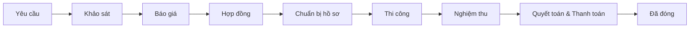
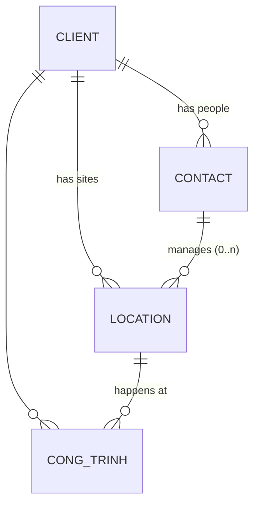

# CRM Business Flow — GreenOrange (Vệ Sinh & Thi Công)

Reference for the Công Trình lifecycle and the per-entity state machines.
This is the source of truth we iterate on — code (`apps/crm-web` enums,
`apps/crm-api-nest/prisma/schema.prisma`) should follow this doc, not the
other way around.

**Status: WIP.** The stage pipeline below is confirmed. The entity state
machines are being redefined one by one — sections marked ⚠️ still show the
old (wrong) model and will be replaced as each entity is discussed.

## Công Trình stage pipeline (confirmed)



**9 stages** (2026-07-23: the old separate Quyết toán and Chờ thanh toán
stages merged into one "Quyết toán & Thanh toán" stage).

Enum: `ProjectStage` (`apps/crm-web/src/app/(dashboard)/projects/enums.ts`),
display order in `src/lib/labels.ts` (`projectStageOrder`) — code still has
the old 10 stages; update when implementing.

## Client model (confirmed)



- **Client** — the commercial entity that is invoiced. `type: cong_ty | ca_nhan`
  (companies and individuals are both served). Most company clients are
  **multi-site**, so Location is first-class in the UI, not hidden.
- **Location** — a client's site: address + `manager` (a Contact). Project
  history is visible per location (repeat business at the same site).
- **Contact** — a person at the client (name, phone/Zalo, title). The person
  who calls in is a Contact (often a middle manager), never the Client
  itself. One Contact can manage several Locations.
- **Công Trình** — belongs to one Client + one Location, and records two
  people:
  - `working contact` — who we coordinate with day-to-day; defaults to the
    Location's manager, overridable.
  - `decision maker` — who approves the báo giá / signs the hợp đồng.
    Sometimes HQ, sometimes the location manager, so it's a per-project
    Contact field (defaults to the working contact).
- **Individuals** (`ca_nhan`) — the client is one person: auto-create a
  single Contact (themselves) and one Location (their address) behind the
  scenes; the UI shouldn't ask an individual homeowner about "sites".

## Stage details (confirmed, one by one)

### 1. Yêu cầu ("Gặp khách")

The client contacts the boss directly (inbound — the client reaches out).
Together they set up an **appointment**, which usually happens **within the
same day** as the first contact.

- Entry: client makes contact.
- Action: agree on an appointment (date/time + location).
- Exit: the appointment takes place → moves into the next stage.
- Data captured: Client (existing or quick-created), the Contact who called,
  the Location concerned, appointment date/time.
- Note: because the turnaround is same-day, the CRM must make
  Yêu cầu → appointment a near-zero-friction step (quick create, today
  pre-filled), not a long-lived pipeline stage.

**Transition 1 → 2:** the appointment _is_ the khảo sát visit. Manual, one
tap — "Đã gặp khách / Bắt đầu khảo sát" — records the real visit date.
Nothing flips automatically on the clock (appointments slip).

Branches while in stage 1:

- **Postponed** → reschedule: update the appointment date, stay in stage 1.
- **No-show / client cancels / dead lead** → project status becomes `huy`
  (see "Project status" below). No verbal pricing ever happens at first
  contact — pricing always waits for Báo giá.

### 2. Khảo sát

The boss is on site (same visit as the stage-1 appointment). Khảo sát is
**notes + photos + measurements only** — input for the quote. No verbal
price is given on the spot.

- Entry: the visit happens.
- Action: record survey notes, photos, measurements against the Công Trình.
- Exit: survey data is enough to build a quote → stage 3 (Báo giá).
- Data captured: notes, photos, measurements (attached to the project;
  a dedicated Khảo sát record stays a deferred exercise for now).

### 3. Báo giá

The boss builds the quote from the khảo sát data and sends it to the client
via **Zalo, email, or printed** — channel depends on the client (record
which channel(s) were used on the quote).

- Entry: khảo sát data ready.
- Action: build quote → send → wait / bargain.
- Exit:
  - Quote **Chốt** → stage 4 (Hợp đồng — contract signing).
  - Quote **Hủy** → project status `huy` (frozen at Báo giá).
  - Quote **Hoãn** → project parked (client wants it, just not now).
- Bargaining: a rejection from the client is not immediately final — it
  opens a bargaining loop (revise price → resend → Chờ again) until the
  quote lands on Chốt, Hoãn, or Hủy.

### 4. Hợp đồng

A written contract is **optional** — some jobs run on the chốt quote alone
(the quote is the agreement). When there is one: printing is done by the
secretary / any operator on our side; **signing on our side is always the
boss**.

- Entry: quote `chot`.
- Action: (optionally) draft + print contract, both sides sign, collect cọc.
- Exit — stage 4 is passed when **both** are done (a checklist on the
  project, independent of whether a written contract exists):
  1. Client signed confirmation (contract, or confirmation of the chốt
     quote).
  2. First payment — **Cọc** (deposit) received. This is the payment
     milestone `tam_ung`, and it officially closes stage 4.
- Building authorization / permits belong to **stage 5** — but to
  streamline, permit paperwork is sometimes sent together with the
  contract, so stage-5 work may start in parallel while stage 4 is open.
- Data captured: signed doc (if any), cọc amount + received date.

### 5. Chuẩn bị hồ sơ

Requirements **vary per client/site**, so this stage is a **per-project
paperwork checklist**, not a fixed form. New projects are seeded with the
common items; operators add/remove items freely per site.

Default checklist (the most common requirements):

1. **Giấy phép thi công** (working permit) — required by _all_ sites.
2. **PCCC** (fire protection & prevention) — required by most buildings,
   rarely waived.
3. **Danh sách nhân sự** (worker list).
4. **Danh sách thiết bị** (equipment list).

- Entry: cọc received (stage 4 done) — though paperwork may have started in
  parallel (sent along with the contract).
- Action: work the checklist — prepare each document, submit to the
  building/client, get it approved.
- Exit: every checklist item on the project is cleared → Thi công can start.
- See "Paperwork item" entity below for per-item states.

### 6. Thi công (WIP — requirements still being gathered)

Stage 6 has its own **sub-status** on the project, advancing in order, with
a note on each step:

```text
khoi_cong (Initiate — kick off on site)
  └─→ dung_rao (Set up hoardings — hoarding/advertising covering the site)
        └─→ thi_cong (Actual works — execution)
```

General data on the project for this stage:

- Start date.
- Working duration — estimated, in days.
- **Actual work duration** — dual-sourced: manual input is the **source of
  truth**, timekeeping-derived duration is secondary. When the two
  conflict, the UI shows a conflict modal to resolve.
- Worker list — who is assigned to the project.
- Approaches — _optional_, some projects need different ways of working.
  Shape unclear yet (free-text per project until a real structure emerges).

**Timekeeping:** workers will eventually clock in/out via a **Zalo mini
app** (chosen because workers already use Zalo), pushing hours back into
the CRM. That integration is a future improvement — for now the CRM does
**manual timekeeping** (operator enters worker hours/days on the project),
designed so an external app can later feed the same records through an
ingest endpoint instead of manual entry.

**Costs are NOT part of this stage** — costs are their own separate
page/flow (they can bleed across projects or stand alone). See the Cost
entity section.

- Entry: paperwork cleared (stage 5 done).
- Exit: a **"works done" confirmation button** — confirms all works are
  complete, optionally with **image logs** as evidence (photo upload; S3
  architecture for this is still to be designed).

### 7. Nghiệm thu

Starts by mailing a "Nghiệm thu" request to the host/client, requesting:

1. Lịch nghiệm thu (acceptance schedule).
2. Biên bản nghiệm thu (acceptance minutes — to be signed).
3. Finish images (same S3 concern as stage 6 image logs).

Stage 7 sub-status, with a **rework loop**:

```text
gui_yeu_cau (Gửi yêu cầu — request mailed, waiting for schedule)
  └─→ nghiem_thu (Nghiệm thu — inspection scheduled/underway)
        ├─→ bo_sung (Bổ sung — client found issues, crew reworks)
        │     └─→ nghiem_thu (re-inspect; loop until passed)
        └─→ dat (Đạt — biên bản signed) → stage 8
```

- Entry: works-done confirmation (stage 6 exit).
- Exit: biên bản nghiệm thu signed → stage 8.

### 8. Quyết toán & Thanh toán (merged stage)

One stage covering settlement and payment, in order:

1. **Quyết toán** — settlement minutes/paper + **draft Bill** prepared and
   sent; client **signs off on both** → draft Bill becomes the **official
   Bill**. Quyết toán is its own entity (decided at stage 3), not a quote
   type.
2. **Mail the official Bill.**
3. **Payment schedule** — payments tracked as milestones against the
   official Bill.
4. **Final payment received** → stage 9 (Đã đóng).

- Entry: biên bản nghiệm thu signed.
- Exit: final payment received.

### 9. Đã đóng

Project finished. No warranty/retention in practice (no "giữ bảo hành"
holdback) — final payment closes the project outright.

## Project status (orthogonal to stage)

The pipeline has no "lost" stage — instead every Công Trình carries a status
next to its stage:

```text
dang_hoat_dong (Đang hoạt động) ⇄ hoan (Hoãn — parked)
dang_hoat_dong | hoan → huy (Hủy, + reason, terminal)
```

- `huy` is terminal and reachable from any stage before Thi công (no-show,
  client goes silent, quote rejected…).
- `hoan` — client wants the job but not now (e.g. quote on hold). Revivable
  back to `dang_hoat_dong`; should carry a follow-up date so parked jobs
  resurface instead of being forgotten.
- The stage is **frozen where the project died/parked**, so reports can show
  _where_ leads are lost (in practice: usually at Báo giá, and rarely).

## Entity state machines

Template for each entity as we redefine it:

- **States** — enum values (snake_case) + Vietnamese label.
- **Transitions** — from → to, who/what triggers it (user action vs. side
  effect of another entity), guards.
- **Dead ends / backward moves** — terminal states, rework loops.
- **Cross-entity effects** — e.g. "quote approved ⇒ project may advance to
  Hợp đồng".

### Quote (Báo giá) — confirmed 2026-07-23

Built by the boss, sent via Zalo / email / print (per client). Sent
channel(s) are recorded on the quote. Quote is **báo giá only** — Quyết toán
is its own entity (see stage 8), no more `type` field. **A quote usually
belongs to a project but can be standalone** (`project_id` nullable, 2026-07-24)
— a walk-in / speculative quote created from `/quotes`, attachable to a project
later; attaching auto-advances that project to Báo giá.

```text
nhap (Nháp — being built, not sent)
  └─→ cho (Chờ — sent, waiting for approval)
        ├─→ chot (Chốt — DEAL → contract signing, stage 4)
        ├─→ hoan (Hoãn — HOLD, client won't do it now; project → hoan)
        └─→ huy  (Hủy — rejected for good; project status → huy)
```

**Bargaining = new version each time.** A quote is never edited after being
sent: client pushback ⇒ create a new version (v1, v2, …) linked to the same
project, which starts at `nhap` again. Every sent version is kept for
history/printables; the **latest version carries the live status**, older
versions are frozen as superseded.

### Contract (Hợp đồng) — partially confirmed 2026-07-23

Optional entity — small jobs run on the chốt quote alone. Printed by
secretary/operator, signed by the boss (our side) + the client. Also
**`project_id`-optional** (2026-07-24) — creatable standalone from
`/contracts`; attaching to a project auto-advances it to Hợp đồng.

```text
nhap (Nháp — drafted/printed, not yet signed by both)
  └─→ da_ky (Đã ký — both sides signed)
```

Open points:

- Old model had `dang_thuc_hien` and `thanh_ly` — do those exist in
  reality, or is `da_ky` the end of the contract's own life (everything
  after lives on the project)? Decide when we reach stages 6–10.

### Paperwork item (Hồ sơ) — confirmed 2026-07-23

One row per required document on a Công Trình (seeded from the defaults in
stage 5, freely added/removed per site). Fields: name, note, attachment.

```text
chua_xong (Chưa xong — being prepared)
  └─→ da_nop (Đã nộp — submitted to building/client, waiting)
        └─→ da_duyet (Đã duyệt — approved/cleared)
```

### Acceptance (Nghiệm thu) — replaced by stage-7 sub-status

No separate Acceptance entity: nghiệm thu is the stage-7 sub-status on the
project (`gui_yeu_cau → nghiem_thu ⇄ bo_sung → dat`), and the signed biên
bản nghiệm thu is an attachment on the project. The old
`cho_nghiem_thu/da_nghiem_thu/co_van_de` model is dead.

### Quyết toán — confirmed 2026-07-23

Its own entity (not a quote type): paperwork + status, nothing more. The
settlement papers are prepared in stage 8, sent with the draft Bill, and
signed by the client.

```text
nhap (Nháp) → da_gui (Đã gửi) → da_ky (Đã ký — client signed)
```

The payment schedule (milestones) **derives from the signed Quyết toán**.

### Bill (Hóa đơn) — confirmed 2026-07-23

Created as a draft alongside the Quyết toán; becomes official when the
client signs off (stage 8). Sent/paid tracking is **manual status
flipping** for now — a future sub-system may read incoming payments from a
bank app and flip `da_thanh_toan` automatically (same pattern as
timekeeping: manual is source of truth, external feed secondary).

```text
nhap (Nháp) → chinh_thuc (Chính thức — client signed off)
  └─→ da_gui (Đã gửi — mailed to client)
        └─→ da_thanh_toan (Đã thanh toán — fully paid)
```

### Payment milestone (Đợt thanh toán) — confirmed 2026-07-23

- Derived from the signed **Quyết toán** (the schedule lives there),
  tracked against the official Bill in stage 8.
- `tam_ung` = the **Cọc** collected at stage 4.
- `giu_bao_hanh` is **dropped** — no warranty retention in practice.

```text
chua_den_han (Chưa đến hạn) → cho_thanh_toan (Chờ thanh toán) → da_thu (Đã thu)
```

Three stored statuses. **Quá hạn is not stored** — it's derived (due date
passed and not `da_thu`), so it can never disagree with the calendar.

### Cost (Chi phí) — separate module, flow TBD

Costs are **not a tab of the Công Trình** — they get their own page/flow,
because the reality is more complicated:

- A cost can belong to one project, **bleed across several projects**
  (needs allocation/splitting), or be **standalone** (company-level,
  attached to no project).
- Old categories (`vat_tu`, `nhan_cong`, `thiet_bi`, `su_co`, `khac`) kept
  until the dedicated cost flow is designed.

Design session for the cost module is pending — treat everything here as
placeholder except "it's separate from the project pipeline".

### Crew (Nhân sự) — confirmed 2026-07-23

Crew answers _who is where_ — the CRM does **not** compute wages (pay
lives in the future Cost module, if ever).

**Crew member** (roster): name, **phone/Zalo** (captured from day one — it
becomes the worker's identity when the Zalo mini app arrives), default
role, employment type, status. Day-hires are common, so the roster
tolerates people who appear for one project and vanish — keep their record
for re-hire.

```text
employment type: chinh_thuc (steady) | thoi_vu (day-hire)
status: dang_lam (Đang làm) ⇄ tam_nghi (Tạm nghỉ) → nghi_viec (Nghỉ việc)
```

**Roles** are a user-managed list (small sub-module: add/rename roles),
**not a hardcoded enum**. Seeded with: Thợ chính, Thợ phụ, Nhân viên vệ
sinh, Giám sát, Lái xe. A member has a default role; the role on each
assignment can override it.

**Assignment**: crew member ↔ Công Trình, with role + from/to dates. The
stage-6 worker list _is_ this list, and the stage-5 "danh sách nhân sự"
paperwork is generated from it. **Double-booking is allowed** (happens
regularly) but the UI shows a **non-blocking warning** on overlapping
assignments.

**Timekeeping record**: one row per worker per project per day (hours or
day-unit), `source: manual | zalo_app`. Manual is source of truth
(stage-6 rule); actual work duration derives from these records.

## Cross-entity rules (confirmed 2026-07-23)

**2026-07-24 — these are auto-advance triggers, not hard gates.** Each event
below moves the project's stage **forward only** (`stage = max(stage,
triggered)`) when it happens; the project is never hard-blocked from a manual
stage move (soft warning instead). Read "gates X" below as "auto-advances the
project to X". The pipeline is the _common_ flow — direct create and pre-CRM
backfill let a job start at any stage.

- Quote `chot` gates stage 4 (contract signing / quote-only agreement).
- Cọc received (`tam_ung` milestone `da_thu`) closes stage 4.
- All paperwork items `da_duyet` gates Thi công.
- Biên bản nghiệm thu signed (stage-7 sub-status `dat`) gates stage 8.
- Quyết toán `da_ky` turns the draft Bill `chinh_thuc` and defines the
  payment milestones.
- Final milestone `da_thu` (Bill `da_thanh_toan`) closes the project.

## Changelog

- 2026-07-23 — doc created; captured current (wrong) state machines as the
  baseline to rewrite entity by entity.
- 2026-07-23 — confirmed: Client model (Client/Location/Contact), stages 1–2,
  transition 1→2, orthogonal project status with `huy`.
- 2026-07-23 — confirmed: stage 3 + Quote state machine (nhap/cho/chot/hoan/huy,
  versioned bargaining); project status gains `hoan`; Quyết toán will be its
  own entity (not a quote type).
- 2026-07-23 — confirmed: stage 4 (2 gates: sign-off + cọc), contract slimmed
  to nhap→da_ky and optional; stage 5 = per-project paperwork checklist
  (defaults: giấy phép thi công, PCCC, worker list, equipment list); new
  Paperwork item entity confirmed (chua_xong/da_nop/da_duyet).
- 2026-07-23 — stage 6 skeleton (sub-status khoi_cong/dung_rao/thi_cong,
  dual-source duration, manual timekeeping + future Zalo mini app); costs
  extracted into their own module.
- 2026-07-23 — pipeline reshaped to 9 stages: Quyết toán + Thanh toán merged;
  stage 7 gets rework sub-status (bo_sung); no warranty retention —
  giu_bao_hanh milestone dropped; Acceptance entity replaced by stage-7
  sub-status; Bill (draft→official) introduced in stage 8.
- 2026-07-23 — confirmed: Quyết toán entity (nhap/da_gui/da_ky, paperwork +
  status only), Bill states (nhap/chinh_thuc/da_gui/da_thanh_toan, manual
  flipping now + future bank feed), milestones derive from Quyết toán with
  3 stored statuses (qua_han derived, not stored).
- 2026-07-23 — confirmed: Crew module — roster (chinh_thuc/thoi_vu, day-hires
  common, Zalo phone as future identity), user-managed roles, assignments
  with overridable role + non-blocking double-booking warning, timekeeping
  records (manual | zalo_app); no wage computation.
- 2026-07-24 — pipeline is the common flow, not the only one: projects can be
  created directly / mid-pipeline (pre-CRM backfill); cross-entity rules are
  auto-advance triggers (forward-only `max` rule), not hard gates — no 400
  blocks, manual moves are soft; Quote and Contract become `project_id`-
  optional (standalone, attachable later, attaching auto-advances the stage).
