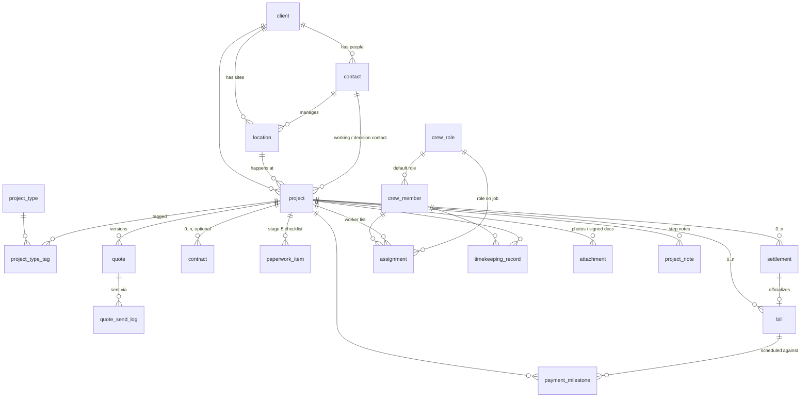

# CRM Relational Schema — draft for review

Derived from [crm-business-flow.md](./crm-business-flow.md) (9-stage
pipeline, confirmed 2026-07-23). Target: Postgres via Prisma in
`apps/crm-api-nest` (its conventions kept: enums stored as snake_case
strings, money as `BigInt` VND, dates serialized `YYYY-MM-DD`).

**Language rule: the database is 100% English** — table names, columns,
enum values. Vietnamese exists in exactly one place: the display-label map
(`apps/crm-web/src/lib/labels.ts`). See the [glossary](#glossary-english--vietnamese)
for the full mapping. The business-flow doc keeps speaking Vietnamese; this
doc is its technical counterpart.

**Status: IMPLEMENTED 2026-07-23** (+ UI-design deltas migration
`ui_design_deltas`, same day — see `crm-ui-redesign.md` Backend deltas)
in `apps/crm-api-nest` (schema.prisma +
migrations `v2_greenorange_flow`, `date_column_naming_convention`).

**Date naming convention** (serialization contract): columns ending `*_date`
are date-only (`@db.Date`, serialized `YYYY-MM-DD`); columns ending `*_at`
are full timestamps (serialized ISO — `appointment_at` keeps its time).

## ER overview

Cost module is deliberately absent — separate design session (see sketch at
the bottom).

## Tables

### client

| column | type | notes |
| --- | --- | --- |
| id | bigserial PK | |
| name | text | company or person name |
| type | text | `company` \| `individual` |
| tax_code | text null | companies |
| note | text null | |
| created_at / updated_at | timestamptz | |

`individual` clients get one auto-created contact (themselves) and one
location (their address) at creation time — app logic, not schema.

### contact

| column | type | notes |
| --- | --- | --- |
| id | bigserial PK | |
| client_id | FK → client | |
| name | text | |
| phone | text null | also Zalo identity |
| email | text null | |
| title | text null | e.g. middle manager |
| note | text null | |

### location

| column | type | notes |
| --- | --- | --- |
| id | bigserial PK | |
| client_id | FK → client | |
| name | text | site label |
| address | text | |
| manager_contact_id | FK → contact, null | one contact can manage many locations |

### project (Công Trình)

The spine. Stage + orthogonal status + per-stage sub-statuses live here.

| column | type | notes |
| --- | --- | --- |
| id | bigserial PK | |
| client_id | FK → client | who signs/pays |
| location_id | FK → location | where |
| working_contact_id | FK → contact | defaults to location manager |
| decision_maker_contact_id | FK → contact | approves quote / signs; defaults to working contact |
| name | text | |
| request_note | text null | stage 1: short "what they want" from the first call (2026-07-23 UI deltas) |
| referral_source | text null | stage 1: free text — giới thiệu, gọi lại, … (2026-07-23 UI deltas) |
| stage | text | `request` `survey` `quote` `contract` `paperwork` `execution` `acceptance` `settlement` `closed` |
| status | text | `active` \| `on_hold` \| `cancelled` — default `active` |
| cancel_reason | text null | required when status = `cancelled` |
| follow_up_date | date null | parked (`on_hold`) jobs resurface |
| appointment_at | timestamptz null | stage 1; reschedule = update in place |
| visit_date | date null | set by "Đã gặp khách" tap (1→2) |
| survey_note | text null | stage 2 notes (photos → attachment) |
| survey_items | jsonb null | stage 2: `{name, quantity, unit, note}[]` — measurement rows that prefill quote items (2026-07-23 UI deltas) |
| client_signed_date | date null | stage-4 gate 1 (contract or deal-quote confirmation) |
| execution_sub_status | text null | `kickoff` \| `hoarding` \| `works` |
| start_date | date null | stage 6 |
| est_duration_days | int null | |
| actual_duration_days | int null | **manual = source of truth**; timekeeping-derived value computed at read time, conflict surfaced in UI |
| approaches | text null | free text until a structure emerges |
| works_done_at | timestamptz null | stage-6 exit button |
| acceptance_sub_status | text null | `request_sent` \| `inspecting` \| `rework` \| `passed` |
| acceptance_passed_date | date null | stamped when acceptance_sub_status → `passed` (2026-07-23 UI deltas) |
| created_at / updated_at | timestamptz | |

Stage-4 gate 2 (deposit received) is not a column — it's the `deposit`
milestone reaching `paid`. Stage-5 exit is "no paperwork_item not yet
`approved`". Both derived, never stored twice.

### project_type + project_type_tag

Project types are a **user-managed tag system** (a job can be both Tháo dỡ
and Thi công), not a hardcoded enum — same pattern as crew_role.

| column | type | notes |
| --- | --- | --- |
| id | bigserial PK | |
| name | text unique | user-facing, Vietnamese: seeded with Vệ sinh, Thi công, Tháo dỡ |

`project_type_tag`: join table `(project_id FK, project_type_id FK)`,
unique pair — a project carries 1..n type tags.

### quote (Báo giá)

| column | type | notes |
| --- | --- | --- |
| id | bigserial PK | |
| project_id | FK → project | |
| version | int | 1, 2, … — bargaining = new row |
| status | text | `draft` `waiting` `deal` `on_hold` `rejected` |
| total_amount | bigint | VND |
| decided_date | date null | deal/on_hold/rejected date |
| note | text null | |

- Unique `(project_id, version)`.
- Sent versions are never edited; **latest version carries the live
  status**, older rows are frozen history.
- How/when it was sent lives in `quote_send_log` (a quote can be sent more
  than once, over more than one channel).

### quote_send_log

One row per send — the boss wants to see *which channel her assistant
used* and *where to follow up*.

| column | type | notes |
| --- | --- | --- |
| id | bigserial PK | |
| quote_id | FK → quote | |
| channel | text | `zalo` \| `email` \| `print` |
| sent_by | text | operator who sent it (user name; FK → users once auth lands here) |
| sent_at | timestamptz | |
| follow_up_ref | text null | where to chase: Zalo chat name, email address, who received the print |

### quote_item

Line items for the printable A4 quote.

| column | type | notes |
| --- | --- | --- |
| id | bigserial PK | |
| quote_id | FK → quote | |
| description | text | |
| unit | text null | m², buổi, … (free text, user-facing) |
| quantity | numeric | |
| unit_price | bigint | VND |
| amount | bigint | VND |
| sort_order | int | |

### contract (Hợp đồng) — optional, 0..n per project

Multiple contracts on one Công Trình happen in practice.

| column | type | notes |
| --- | --- | --- |
| id | bigserial PK | |
| project_id | FK → project | |
| status | text | `draft` \| `signed` |
| signed_date | date null | |
| note | text null | signed scan → attachment |

### paperwork_item (Hồ sơ — stage-5 checklist)

| column | type | notes |
| --- | --- | --- |
| id | bigserial PK | |
| project_id | FK → project | |
| name | text | user-facing, stays Vietnamese: seeded with Giấy phép thi công, PCCC, Danh sách nhân sự, Danh sách thiết bị; freely added/removed |
| status | text | `preparing` \| `submitted` \| `approved` |
| due_date | date null | permits have lead times; overdue DERIVED (`due_date < today && != approved`), never stored (2026-07-23 UI deltas) |
| note | text null | |

The 4 default items are **auto-created with the project** (2026-07-23 UI
deltas); `POST /paperwork-items/defaults` stays as a re-seed.

### settlement (Quyết toán) — 0..n per project

Settling happens **in phases** (sometimes corrections) — hence 0..n.

| column | type | notes |
| --- | --- | --- |
| id | bigserial PK | |
| project_id | FK → project | |
| status | text | `draft` \| `sent` \| `signed` |
| total_amount | bigint | VND, server-computed from settlement_item rows; copied to the bill on sign (2026-07-23 UI deltas) |
| signed_date | date null | |
| note | text null | papers → attachment |

### settlement_item (2026-07-23 UI deltas)

Line items for the printable Quyết toán — prefilled from the chốt quote's
items, quantities adjusted to khối lượng thực tế. Mirrors `quote_item`.

| column | type | notes |
| --- | --- | --- |
| id | bigserial PK | |
| settlement_id | FK → settlement, cascade delete | |
| description | text | |
| unit | text null | |
| quantity | numeric | actuals, not quoted |
| unit_price | bigint | VND |
| amount | bigint | VND, server-computed |
| sort_order | int | |

On settlement **sign** (one transaction): bill gets `total_amount` + flips
`official`; the project's unallocated `deposit` milestone (bill_id null)
attaches to this bill; one `progress` milestone is auto-created for the
remaining balance (splittable afterwards). Closed projects (stage
`closed`) are **locked**: mutations rejected except project notes and the
reopen transition (`closed → settlement`).

### bill (Hóa đơn) — 0..n per project

| column | type | notes |
| --- | --- | --- |
| id | bigserial PK | |
| project_id | FK → project | |
| settlement_id | FK → settlement, null | signing the settlement flips its bill to `official`; unique — one bill per settlement |
| status | text | `draft` `official` `sent` `paid` — manual flips; future bank feed auto-flips `paid` |
| total_amount | bigint | VND |
| sent_date / paid_date | date null | |

### payment_milestone (Đợt thanh toán)

| column | type | notes |
| --- | --- | --- |
| id | bigserial PK | |
| project_id | FK → project | |
| bill_id | FK → bill, null | null for the deposit (exists before any bill) |
| type | text | `deposit` (= Cọc, stage 4) \| `progress` \| `acceptance` |
| amount | bigint | VND |
| due_date | date null | |
| status | text | `not_due` `awaiting_payment` `paid` |
| paid_date | date null | |

**`overdue` is derived, never stored**: `due_date < today AND status != 'paid'`.

### crew_role — user-managed sub-module

| column | type | notes |
| --- | --- | --- |
| id | bigserial PK | |
| name | text unique | user-facing, stays Vietnamese: seeded with Thợ chính, Thợ phụ, Nhân viên vệ sinh, Giám sát, Lái xe |

### crew_member

| column | type | notes |
| --- | --- | --- |
| id | bigserial PK | |
| name | text | |
| phone | text null | Zalo — future mini-app identity, capture from day one |
| employment_type | text | `permanent` \| `day_hire` (day-hires common) |
| default_role_id | FK → crew_role, null | |
| status | text | `working` ⇄ `on_leave` → `left` |
| note | text null | |

### assignment (worker ↔ project)

| column | type | notes |
| --- | --- | --- |
| id | bigserial PK | |
| project_id | FK → project | |
| crew_member_id | FK → crew_member | |
| role_id | FK → crew_role, null | overrides member's default role |
| from_date / to_date | date | to_date null = open-ended |

Overlapping assignments for one member are **allowed** — the app shows a
non-blocking warning, no DB constraint. Stage-5 "Danh sách nhân sự" and the
stage-6 worker list are generated from these rows.

### timekeeping_record

| column | type | notes |
| --- | --- | --- |
| id | bigserial PK | |
| crew_member_id | FK → crew_member | |
| project_id | FK → project | |
| work_date | date | |
| hours | numeric | raw hours worked that day |
| source | text | `manual` \| `zalo_app` — manual is source of truth |
| note | text null | |

Unique `(crew_member_id, project_id, work_date, source)` — a manual row and
a zalo_app row may coexist for the same day; conflicts resolved in UI.

### attachment

One generic table for every file in the flow (S3 architecture TBD — table
shape is stable regardless).

| column | type | notes |
| --- | --- | --- |
| id | bigserial PK | |
| project_id | FK → project | |
| kind | text | `survey` \| `site_log` \| `finish_image` \| `signed_contract` \| `acceptance_report` \| `settlement` \| `paperwork` \| `other` |
| paperwork_item_id | FK → paperwork_item, null | when kind = `paperwork` |
| s3_key | text | |
| note | text null | |
| created_at | timestamptz | |

### project_note

Step-level notes (stage-6 sub-steps, acceptance rework rounds, anything).

| column | type | notes |
| --- | --- | --- |
| id | bigserial PK | |
| project_id | FK → project | |
| tag | text null | e.g. `kickoff`, `hoarding`, `rework` |
| body | text | |
| created_at | timestamptz | |

## Glossary (English ↔ Vietnamese)

The single source for `labels.ts`. User-entered content (paperwork names,
crew role names, quote units) is data, stays Vietnamese as typed.

| entity.field | English value | Vietnamese label |
| --- | --- | --- |
| client.type | company / individual | Công ty / Cá nhân |
| project types | (user-managed `project_type` rows, not an enum) | seeded: Vệ sinh, Thi công, Tháo dỡ |
| project.stage | request | Yêu cầu (Gặp khách) |
| | survey | Khảo sát |
| | quote | Báo giá |
| | contract | Hợp đồng |
| | paperwork | Chuẩn bị hồ sơ |
| | execution | Thi công |
| | acceptance | Nghiệm thu |
| | settlement | Quyết toán & Thanh toán |
| | closed | Đã đóng |
| project.status | active / on_hold / cancelled | Đang hoạt động / Hoãn / Hủy |
| project.execution_sub_status | kickoff / hoarding / works | Khởi công / Dựng rào / Thi công |
| project.acceptance_sub_status | request_sent / inspecting / rework / passed | Gửi yêu cầu / Nghiệm thu / Bổ sung / Đạt |
| quote.status | draft / waiting / deal / on_hold / rejected | Nháp / Chờ / Chốt / Hoãn / Hủy |
| contract.status | draft / signed | Nháp / Đã ký |
| paperwork_item.status | preparing / submitted / approved | Chưa xong / Đã nộp / Đã duyệt |
| settlement.status | draft / sent / signed | Nháp / Đã gửi / Đã ký |
| bill.status | draft / official / sent / paid | Nháp / Chính thức / Đã gửi / Đã thanh toán |
| payment_milestone.type | deposit / progress / acceptance | Tạm ứng (Cọc) / Theo tiến độ / Khi nghiệm thu |
| payment_milestone.status | not_due / awaiting_payment / paid | Chưa đến hạn / Chờ thanh toán / Đã thu |
| (derived) | overdue | Quá hạn |
| crew_member.employment_type | permanent / day_hire | Chính thức / Thời vụ |
| crew_member.status | working / on_leave / left | Đang làm / Tạm nghỉ / Nghỉ việc |
| timekeeping_record.source | manual / zalo_app | Thủ công / Zalo app |

## Cost module — sketch only (own design session pending)

Not in this schema. When designed, expect roughly:
`cost` (amount, category, date, standalone-capable) +
`cost_allocation` (cost_id, project_id, amount) so one cost can split
across projects or attach to none.

## Cross-entity rules recap (enforced in app/service layer)

1. Quote `deal` (latest version) → stage 4 may begin.
2. `deposit` milestone `paid` + `client_signed_date` set → stage 4 done.
3. All paperwork_items `approved` → execution may start.
4. `acceptance_sub_status = passed` → stage 8 may begin.
5. Settlement `signed` ⇒ its bill `official` + milestones created from it.
6. **All** milestones `paid` and **all** bills `paid` ⇒ stage `closed`
   (projects can carry several settlements/bills).

## Resolved review questions (2026-07-23)

1. Project types → user-managed **tag system** (`project_type` +
   `project_type_tag`), seeded Vệ sinh / Thi công / Tháo dỡ.
2. Quote sends → **per-send log rows** (`quote_send_log`: channel, sent_by,
   follow_up_ref).
3. Contract / settlement / bill are **0..n per project** (multiple
   instances happen in practice); one bill per settlement.
4. Timekeeping records **raw hours**.
