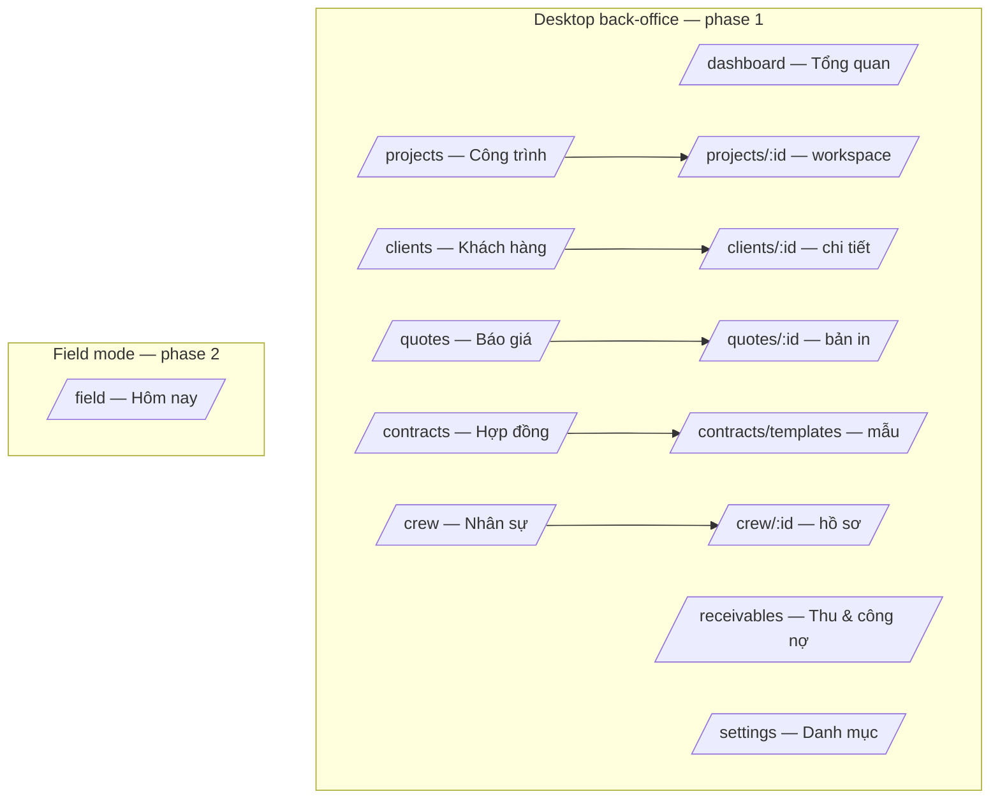

# CRM UI Redesign — v2 GreenOrange

Design spec for rebuilding `apps/crm-web` against the v2 backend
(`apps/crm-api-nest`). Companions: `crm-business-flow.md` (what the business
does) and `crm-database-schema.md` (the contract + EN↔VN glossary).

**Status: stage design pass COMPLETE, backend deltas APPLIED
(2026-07-23).** All 9 stage panels confirmed one by one (sections below);
the Backend-deltas migration + module changes are live in `crm-api-nest`.
Next: frontend build phase 1 (contract layer). Non-stage screens
(dashboard, clients, crew, receivables) carry the baseline spec and get
refined during build.

**Decisions (2026-07-23):**

1. Project detail = **guided stage workspace** (stepper + current-stage panel
   with gates), not flat entity tabs.
2. **Two explicit modes**: full desktop back-office (phase 1) + compact mobile
   "field mode" for the boss on site (phase 2).
3. **No new visual identity** — keep `@yan/ui` components, Tailwind v4 tokens,
   light/dark. The redesign is information architecture + v2 contract.

## Principles

- **The pipeline is the product.** Every screen answers "what does this job
  need next?" — the stage panel shows the gates the server enforces, so a
  blocked stage move is never a surprise 400.
- **Vietnamese in the UI, English in the code.** Enum values come from the v2
  API in English; `labels.ts` (regenerated from the glossary) is the only
  place Vietnamese labels live.
- **Zero-friction stage 1.** Client calls → appointment logged in under 30
  seconds, from dashboard or field mode (quick-create client/contact inline).
- **Derived, never stored.** Overdue milestones, timekeeping totals, overlap
  warnings — computed for display, exactly like the backend does.
- **Print is a first-class output.** Quotes, contracts, settlements, bills all
  render through `DocumentShell` (kept as-is).
- **Pages, not dialogs** (2026-07-23). Creating or editing a real entity
  (project intake, client, quote, contract, settlement, crew member) is a
  dedicated page/route or an inline form on the detail page — never a
  multi-field modal, never a nested modal-in-modal. Dialogs are reserved
  for tiny confirms: Hủy reason, a date pick, a status flip.

## Information architecture



Sidebar order: Tổng quan · Công trình · Khách hàng · Báo giá · Hợp đồng ·
Thu & công nợ · Nhân sự · Danh mục.

**Deleted from nav and disk:** `leads/`, `deals/`, `tasks/`, `contacts/`
route folders (v1 generic CRM, already unlinked), `formatUSD`, the old
Costs tab on project detail (Cost module is its own future design session
— until then costs simply don't appear in the UI).

**Kept:** `DocumentShell` + `SignatureBlocks`, `format.ts` (`formatVND`,
`formatDate`), `vnd-in-words.ts`, the Lexical contract-template editor,
`force-dynamic` on the dashboard layout, live/mock seam (`CRM_API_URL`
unset → mocks). **Dropped pattern:** v1's everything-in-a-modal forms —
see "Pages, not dialogs" below.

## The Công Trình workspace (`/projects/:id`)

The center of the app. Three zones:

```text
┌──────────────────────────────────────────────────────────────┐
│ CT-2026-001 · Vệ sinh kính toà A          [Đang hoạt động]   │
│ Công ty TNHH An Phát · Toà nhà A — Q.1    (Vệ sinh)          │
│ Liên hệ: Trần Văn B (0903…)  ·  Quyết định: Trần Văn B       │
│                                                              │
│ ①──②──③──●④──⑤──⑥──⑦──⑧──⑨        [Hoãn ▾] [Hủy]         │
│ Yêu cầu … Hợp đồng … Đã đóng                                 │
├──────────────────────────────────────────────────────────────┤
│ ZONE 2 — panel of the CURRENT stage (see per-stage specs)    │
├──────────────────────────────────────────────────────────────┤
│ ZONE 3 — tabs: Báo giá · Hồ sơ · Nhân sự · Thanh toán ·      │
│                Ghi chú & tệp                                 │
└──────────────────────────────────────────────────────────────┘
```

- **Zone 1 — header.** Code, name, status badge, client → location →
  contacts, type tags. The 9-step stepper: completed steps filled, current
  highlighted, future dimmed. Clicking a _past_ step scrolls to its summary;
  the _next_ step is a button that runs the stage move (server enforces
  gates; the panel already shows them, so the button is disabled with a
  reason until they're green). `Hoãn` asks for a follow-up date; `Hủy` asks
  for the required reason. Parked/cancelled projects show a banner with the
  frozen stage + reason, and `Hoãn` offers "Kích hoạt lại".
- **Zone 2 — stage panel.** Only the current stage's panel renders. Each
  panel = gate checklist (live from the same data the server gates on) +
  the stage's own fields/actions.
- **Zone 3 — entity tabs.** Always available regardless of stage (paperwork
  can start during stage 4, crew can be assigned early). Tabs reuse the same
  components the stage panels embed.

### Per-stage panels (first-pass draft — each stage confirmed below, one by one)

| #   | Stage                   | Panel contents                      | Gate to advance (server-enforced)    |
| --- | ----------------------- | ----------------------------------- | ------------------------------------ |
| 1   | Yêu cầu                 | ✅ confirmed — see "Stage 1" below. | —                                    |
| 2   | Khảo sát                | ✅ confirmed — see "Stage 2" below. | —                                    |
| 3   | Báo giá                 | ✅ confirmed — see "Stage 3" below. | latest quote `deal`                  |
| 4   | Hợp đồng                | ✅ confirmed — see "Stage 4" below. | — (gates apply to _entering_ 6)      |
| 5   | Chuẩn bị hồ sơ          | ✅ confirmed — see "Stage 5" below. | all items `approved` + stage-4 gates |
| 6   | Thi công                | ✅ confirmed — see "Stage 6" below. | —                                    |
| 7   | Nghiệm thu              | ✅ confirmed — see "Stage 7" below. | sub-status `passed`                  |
| 8   | Quyết toán & Thanh toán | ✅ confirmed — see "Stage 8" below. | all milestones + bills `paid`        |
| 9   | Đã đóng                 | ✅ confirmed — see "Stage 9" below. | terminal (reopen → stage 8)          |

### Stage 1 — Yêu cầu (confirmed 2026-07-23)

**Intake page** (`/projects/new` — "+ Tiếp nhận yêu cầu" buttons on the
dashboard header + projects list link here) — one submit creates the
stage-1 project and lands on its workspace:

```text
┌─ /projects/new · Tiếp nhận yêu cầu ────────────┐
│ Khách hàng    [search… ▾]  (+ tạo nhanh)       │
│ Người liên hệ [auto from client ▾] (+ tạo nhanh)│
│ Địa điểm      [auto from client ▾] (+ tạo nhanh)│
│ Loại          [Vệ sinh] [Thi công] [Tháo dỡ]   │
│ Tên công trình [___________] (gợi ý tự động)   │
│ Yêu cầu       [mô tả ngắn___________________]  │
│ Nguồn         [giới thiệu / gọi lại / …______] │
│ Hẹn gặp       [Hôm nay ▾] [15:00]              │
│                              [Tạo công trình]  │
└────────────────────────────────────────────────┘
```

- Client is search-first (repeat clients are the norm); "tạo nhanh"
  expands an inline section on the same page (name + type only — details
  later), never a nested modal. Picking a client auto-fills most-recent
  contact + location; individuals skip contact/location (backend
  auto-creates).
- Name auto-suggested "{type} {location}", editable.
- **Yêu cầu** = short request description (`request_note`).
- **Nguồn** = referral source (`referral_source`), free text — not a managed
  list (YAGNI).
- Appointment defaults to today; time required (drives the dashboard's
  "Hôm nay" block).

**Stage-1 panel:**

```text
┌ GIAI ĐOẠN 1 · YÊU CẦU ─────────────────────────┐
│ Yêu cầu: "Vệ sinh kính mặt ngoài toà A"        │
│ Nguồn: giới thiệu (chị Hoa)                    │
│ 📅 Hẹn gặp: Hôm nay 15:00 · Toà nhà A [Dời hẹn]│
│                                                │
│ [✓ Đã gặp khách — bắt đầu khảo sát]            │
└────────────────────────────────────────────────┘
```

- **Dời hẹn** edits `appointment_at` in place — no reschedule history.
- The button sets `visit_date` (today, editable) and moves to stage 2 in
  one action.
- No stage-specific cancel: no-show/dead lead uses the header's global
  **Hủy** (reason required).

### Stage 2 — Khảo sát (confirmed 2026-07-23)

```text
┌ GIAI ĐOẠN 2 · KHẢO SÁT ────────────────────────┐
│ Đã gặp khách: 23/07/2026  [sửa]                │
│                                                │
│ Hạng mục đo đạc                    [+ Thêm dòng]│
│ ┌ Hạng mục          │ SL   │ ĐV │ Ghi chú ────┐│
│ │ Kính mặt ngoài    │ 320  │ m² │ tầng 12–18  ││
│ │ Kính sảnh         │  45  │ m² │             ││
│ └───────────────────┴──────┴────┴─────────────┘│
│                                                │
│ Ghi chú khảo sát (giờ làm, an toàn, tiếp cận…) │
│ ┌────────────────────────────────────────────┐ │
│ │ cần dây đu, giờ làm 6h–9h sáng…            │ │
│ └────────────────────────────────────────────┘ │
│                                                │
│ Hình ảnh (3)                       [+ Thêm ảnh]│
│  · mat-ngoai-1.jpg — "vết ố tầng 15"           │
│                                                │
│ [✓ Đủ dữ liệu — lập báo giá]                   │
└────────────────────────────────────────────────┘
```

- **Measurement rows** (`survey_items`, JSON on Project: `{name, quantity,
unit, note}[]`) — inline-editable rows; they **prefill quote line items**
  (name → description, quantity + unit carried over, price left empty).
- **One free-text note** (`survey_note`) for everything else: access hours,
  safety constraints, site conditions.
- **Photos: metadata-only is fine for launch** — attachments record
  filename + note, actual files stay on the phone/Zalo until the S3
  session. No upload work pulled forward.
- Exit button moves to stage 3 **and** navigates to the quote-builder page
  prefilled from the measurement rows.

### Stage 3 — Báo giá (confirmed 2026-07-23)

**Panel = versions rail**, latest on top carrying the live status; older
versions frozen as "Đã thay thế" with their printable kept:

```text
┌ GIAI ĐOẠN 3 · BÁO GIÁ ─────────────────────────┐
│ BG-2026-012 · v2   [Chờ duyệt]    36.000.000₫  │
│   Gửi: Zalo 23/07 (Thư ký) · In 23/07          │
│   [Chốt ✓] [Hoãn] [Hủy]   [Gửi lại] [Tạo v3]   │
│   [Xem bản in]                                 │
│ ────────────────────────────────────────────── │
│ v1 · Đã thay thế · 40.000.000₫    [Xem bản in] │
└────────────────────────────────────────────────┘
```

Per-state actions on the latest version:

- **Nháp** — [Sửa] (builder page) · [Gửi] · [Xóa nháp]. Gửi is a tiny
  confirm (allowed dialog): channels Zalo/Email/In (multi-select → one
  `QuoteSendLog` row per channel) + who sent.
- **Chờ** — [Chốt]/[Hoãn]/[Hủy] · [Gửi lại] · [Tạo phiên bản mới] =
  bargaining, copies the version into a new draft on the builder page.
- **Chốt** — panel turns green; "→ Sang giai đoạn Hợp đồng" becomes the
  primary button.

**Chained decisions (decision A, 2026-07-23):** [Hoãn] asks one question
("Hẹn theo dõi lại ngày nào?") then flips quote → `on_hold` AND project →
`on_hold` with that follow-up date. [Hủy] asks the reason once, flips
quote → `rejected` AND project → `cancelled` with that reason (prefilled
"Khách hủy báo giá v2"). Quote and project never disagree; no separate
parking chore.

**Quote builder page** (`/projects/:id/quotes/new`):

```text
┌ Lập báo giá · CT-2026-001 · v3 ─────────────────┐
│ Hạng mục            SL    ĐV   Đơn giá   T.tiền │
│ Kính mặt ngoài     320    m²   100.000   32tr   │
│ [+ Thêm dòng]                                   │
│ VAT [ 8 ]%   Tạm tính 36tr · Tổng 38,88tr       │
│ Điều khoản & ghi chú                            │
│ ┌─────────────────────────────────────────────┐ │
│ │ Báo giá hiệu lực 30 ngày. Chưa gồm…         │ │
│ └─────────────────────────────────────────────┘ │
│           [Lưu nháp]  [Lưu & gửi ngay]          │
└─────────────────────────────────────────────────┘
```

- Prefilled from survey rows (new quote) or the superseded version
  (bargaining). Totals display-side only — server recomputes,
  authoritative.
- **VAT exposed and editable** per quote, default 8% (`vat_rate`).
- **Điều khoản & ghi chú** = existing `Quote.note`, rendered as the terms
  block on the printable. **No backend deltas for stage 3.**

### Stage 4 — Hợp đồng (confirmed 2026-07-23)

```text
┌ GIAI ĐOẠN 4 · HỢP ĐỒNG ────────────────────────┐
│ Điều kiện hoàn thành                            │
│ ☑ Báo giá đã chốt         v2 · 36.000.000₫     │
│ ☐ Khách ký xác nhận       [Ghi nhận đã ký]     │
│ ☐ Nhận cọc (tạm ứng)      [Ghi nhận cọc]       │
│                                                 │
│ Hợp đồng (không bắt buộc)     [+ Tạo hợp đồng]  │
│ HD-2026-003 · Nháp   [Sửa] [In] [Đánh dấu đã ký]│
│                                                 │
│ ℹ Hồ sơ có thể chuẩn bị song song → tab Hồ sơ  │
└─────────────────────────────────────────────────┘
```

- **Ghi nhận đã ký** — date confirm (today default) → `client_signed_date`.
  Independent of any written contract, so quote-only jobs pass the gate the
  same way. **Date is the only evidence recorded** — no attachment slot.
- **Ghi nhận cọc** — amount + received date; creates the deposit milestone
  (`bill_id` null) and marks it `paid`. Amount varies job-to-job but
  **prefills at 60% of the chốt quote total** (UI-side computation).
- **Contract card** — 0..n contracts; create → the Lexical template-editor
  page (kept, merge fields from project + chốt quote); print via
  `DocumentShell`; "Đánh dấu đã ký" stamps `signed_date` (today default).
- **Chaining:** marking a contract Đã ký auto-sets `client_signed_date`
  (if empty) — both sides signing the contract IS the client confirmation.
  UI-orchestrated, same as stage-3 chaining.
- No backend deltas.

### Stage 5 — Chuẩn bị hồ sơ (confirmed 2026-07-23)

```text
┌ GIAI ĐOẠN 5 · CHUẨN BỊ HỒ SƠ ──────────────────┐
│ Hồ sơ (2/4 đã duyệt)                [+ Thêm mục]│
│                                                 │
│ Giấy phép thi công   ●──●──●  Đã duyệt          │
│ PCCC · hạn 30/07     ●──●──○  Đã nộp   [Duyệt]  │
│ Danh sách nhân sự    ●──○──○  Chưa xong [Nộp]   │
│   ↳ [Tạo từ phân công] (3 người đã phân công)   │
│ Danh sách thiết bị   ●──○──○  Chưa xong [Nộp] ✕ │
└─────────────────────────────────────────────────┘
```

- Rows: name, one-way single-tap status stepper (`Chưa xong → Đã nộp →
Đã duyệt`), expandable note + attachment (metadata). ✕ deletes.
- **Auto-seeded**: the 4 default items are created automatically with the
  project (backend delta — was a manual button). Zero-paperwork jobs just
  delete them (or ignore: gate is vacuous with zero items — "Không cần
  hồ sơ").
- **Due date** (`due_date`, optional) — permits have lead times and
  buildings forget. Overdue = derived (due date passed, not `approved`),
  shown as a red date chip here and in the dashboard's "Cần theo dõi"
  block.
- Who an item was submitted to lives in the per-item **note** — no extra
  field.
- **Danh sách nhân sự** row gets a "Tạo từ phân công" helper — renders a
  printable worker list (DocumentShell) from current assignments. No
  equipment model for Danh sách thiết bị (YAGNI).

### Stage 6 — Thi công (confirmed 2026-07-23)

```text
┌ GIAI ĐOẠN 6 · THI CÔNG ────────────────────────┐
│ Khởi công ●──● Dựng rào ──○ Thi công            │
│                    [→ Bắt đầu thi công]         │
│                                                 │
│ Bắt đầu: 25/07 · Dự kiến 10 ngày (→ 04/08) ⚠trễ │
│ Thực tế: [ 12 ] ngày (nhập tay — nguồn chính)   │
│   Chấm công: 96 giờ / 11 ngày có ghi nhận  ⚠    │
│   [Xem chênh lệch]                              │
│                                                 │
│ Nhân sự (3)  · Trùng lịch: 1 ⚠   [→ tab Nhân sự]│
│ Cách thức thi công: [dây đu, làm đêm…________]  │
│                                                 │
│ [✓ Xác nhận hoàn tất thi công]                  │
│    + ảnh hoàn công (tùy chọn, metadata)         │
└─────────────────────────────────────────────────┘
```

- **Sub-status stepper**, one-way, single tap. **Dựng rào is skippable**
  (indoor jobs): Khởi công → Thi công allowed directly. Each advance
  offers an _optional_ note → stored as a ProjectNote with the sub-status
  as context (timeline in Zone 3), no per-step note columns.
- **Est end derived**: `start_date + est_duration_days`; "trễ" chip when
  today is past it and works aren't done.
- **Duration dual-sourced, no hard conversion rule**: manual
  `actual_duration_days` = source of truth; timekeeping shown as-is
  (total hours + distinct recorded days). Disagreement → ⚠ +
  [Xem chênh lệch] modal (comparison view — allowed dialog) with per-day
  records; she resolves by editing either side. No 8h=1-day math —
  invented rules create fake conflicts.
- Worker list = assignment summary (count + overlap chip), editing in the
  Nhân sự tab. Approaches = free text (`approaches`).
- Exit stamps `works_done_at` → stage 7; optional image-log attachments.

### Stage 7 — Nghiệm thu (confirmed 2026-07-23)

```text
┌ GIAI ĐOẠN 7 · NGHIỆM THU ──────────────────────┐
│ Gửi yêu cầu ●──● Nghiệm thu ⇄ Bổ sung ──○ Đạt   │
│                                                 │
│ Trạng thái: Đang nghiệm thu                     │
│ [Khách báo lỗi → Bổ sung]    [✓ Đạt — ký BB]    │
│                                                 │
│ Lịch sử: 24/07 Bổ sung — "ố kính tầng 15"       │
│          25/07 Nghiệm thu lại                   │
│                                                 │
│ [In thư yêu cầu nghiệm thu]                     │
│ Biên bản nghiệm thu: (đính kèm khi Đạt)         │
└─────────────────────────────────────────────────┘
```

- Entering stage 7 sets `request_sent` automatically — the stage starts by
  requesting; no extra tap.
- **Formal printable request** — [In thư yêu cầu] renders a DocumentShell
  letter (letterhead, signature blocks) listing the three asks: lịch
  nghiệm thu, biên bản nghiệm thu, hình ảnh hoàn công.
- Transition buttons: "Khách đã hẹn lịch" (→ inspecting) · "Khách báo lỗi
  → Bổ sung" (→ rework, **note required** — what the client found) ·
  "Bổ sung xong — nghiệm thu lại" (→ inspecting) · "Đạt" (→ passed,
  **stamps `acceptance_passed_date`**, unlocks stage 8). Notes land in
  the ProjectNote timeline; the rework history shown is those notes
  filtered.
- Signed biên bản = attachment (metadata) on Đạt.

### Stage 8 — Quyết toán & Thanh toán (confirmed 2026-07-23)

**Settling happens in phases** (sometimes corrections) — the panel is a
list of settlement cards, newest/active on top, each card owning its bill
and that bill's milestones:

```text
┌ GIAI ĐOẠN 8 · QUYẾT TOÁN & THANH TOÁN ─────────┐
│ ▼ QT-2026-004 · Đợt 1     Nháp ─● Đã gửi ─○ Ký  │
│   38.500.000₫  [Sửa] [In] [Đã gửi] [✓ Đã ký]    │
│   ② Hóa đơn HĐ-004 · Nháp (chính thức khi ký)   │
│      [In đề nghị thanh toán] [Đã gửi] [Đã thu]  │
│   ③ Đợt thanh toán                  [+ Thêm đợt]│
│      Tạm ứng (cọc)  21,6tr · Đã thu 23/07 ✓     │
│      Đợt cuối       16,9tr · hạn 15/08 ⚠Quá hạn │
│                     [Ghi nhận đã thu]           │
│ ▸ (các đợt quyết toán trước…)                   │
│                                                 │
│ Toàn công trình: Đã thu 21,6tr / 38,5tr         │
│                            [+ Quyết toán mới]   │
└─────────────────────────────────────────────────┘
```

- **Settlement builder page** ([Soạn quyết toán] / [Sửa], drafts only) —
  **line-items editor prefilled from the chốt quote's items**; quantities
  adjusted to khối lượng thực tế, rows addable/removable. Server computes
  amounts/total (mirror of the quotes module). Printable via
  DocumentShell.
- **"Khách đã ký"** (one action, backend transaction): stamps
  `signed_date`, flips the bill **Chính thức** with total = settlement
  total, **attaches the unallocated cọc milestone to this first bill**,
  and **auto-creates one milestone for the remaining balance** (bill −
  cọc) — she can then split it into đợt with [+ Thêm đợt] or edit dates.
- **Hóa đơn**: forward-only manual flips, dates default today. Printable
  = internal "Đề nghị thanh toán"; the real VAT e-invoice lives outside
  the CRM.
- Quá hạn derived (due date passed, unpaid), red chip here + dashboard +
  `/receivables`.
- Gate to Đã đóng: all bills + all milestones paid (server-enforced).

### Stage 9 — Đã đóng (confirmed 2026-07-23)

```text
┌ GIAI ĐOẠN 9 · ĐÃ ĐÓNG ─────────────────────────┐
│ ✓ Hoàn thành · Đã thu đủ 38.500.000₫            │
│                                                 │
│ Hẹn gặp 20/07 → Đóng 20/08 (31 ngày)            │
│ Thi công: 12 ngày · Nghiệm thu: 1 lần bổ sung   │
│ Tài liệu: Báo giá v2 · HD-003 · QT-004 · BB NT  │
│                                                 │
│ [+ Công trình mới tại địa điểm này]   [Mở lại]  │
└─────────────────────────────────────────────────┘
```

- Read-only recap from existing data: date stamps (`visit_date`,
  `works_done_at`, `acceptance_passed_date`), money from bills/milestones,
  links to all printables. No new fields.
- **Locked on close**: entities of a closed project reject edits (server-
  enforced); viewing/printing always works, notes stay allowed. **[Mở
  lại]** returns the project to stage 8 and unlocks — corrections usually
  mean another settlement phase anyway.
- **[+ Công trình mới tại địa điểm này]** — repeat-business shortcut:
  opens intake prefilled with this client/location/contacts; a completely
  separate new Công Trình.

## Backend deltas — ✅ APPLIED 2026-07-23 (migration `20260723142049_ui_design_deltas`)

| Model          | Change                                                                                                                                                                                                               | From stage |
| -------------- | -------------------------------------------------------------------------------------------------------------------------------------------------------------------------------------------------------------------- | ---------- |
| Project        | `request_note String?`                                                                                                                                                                                               | 1          |
| Project        | `referral_source String?`                                                                                                                                                                                            | 1          |
| Project        | `survey_items Json?` — `{name, quantity, unit, note}[]` (scratch input for quote prefill; JSON, not a table — never queried across projects)                                                                         | 2          |
| PaperworkItem  | `due_date DateTime? @db.Date` — overdue derived, never stored                                                                                                                                                        | 5          |
| (behavior)     | `POST /projects` auto-creates the 4 default paperwork items (replaces the manual `/paperwork-items/defaults` call; endpoint can stay for re-seeding)                                                                 | 5          |
| (behavior)     | `execution_sub_status`: allow `kickoff → works` directly (Dựng rào skippable) — verify current PATCH validation permits it                                                                                           | 6          |
| Project        | `acceptance_passed_date DateTime? @db.Date` — stamped on sub-status → `passed`                                                                                                                                       | 7          |
| SettlementItem | new table mirroring QuoteItem (`settlement_id`, `description`, `unit`, `quantity`, `unit_price`, `amount`, `sort_order`) — prefilled from quote items, quantities adjusted to actuals; server computes amounts/total | 8          |
| Settlement     | `total_amount BigInt` (server-computed from items; copied to bill on sign)                                                                                                                                           | 8          |
| (behavior)     | on settlement sign: attach unallocated cọc milestone (`bill_id` null, paid) to the new official bill + auto-create one milestone for the remaining balance                                                           | 8          |
| (behavior)     | closed projects are locked: mutations on the project + its entities rejected (except ProjectNote and the reopen action `stage: closed → settlement`)                                                                 | 9          |

## Other desktop screens

### Tổng quan (`/dashboard`)

Four blocks, all v2-derived — replaces the v1 rollup cards:

1. **Hôm nay** — appointments today (stage-1 projects with `appointment_at`
   today), tap-through to workspace.
2. **Pipeline** — 9 columns with project counts + total quoted value per
   stage (active projects only).
3. **Công nợ** — milestones `awaiting_payment` + derived overdue, bills
   `sent` unpaid; sum + top rows, link to `/receivables`.
4. **Cần theo dõi** — `on_hold` projects whose `follow_up_date` has arrived.

Plus the header button **"+ Tiếp nhận yêu cầu"** → the intake page
(`/projects/new`, see Stage 1).

### Công trình list (`/projects`)

Table: code, name, client, location, type tags, stage chip, status badge,
appointment/next-due hint. Filters: stage, status, type. Default view hides
`cancelled`. Row → workspace.

### Khách hàng (`/clients`, `/clients/:id`)

List: name, type (Công ty/Cá nhân), locations count, active projects.
Detail: info card + **Locations** (address, manager, per-location project
history — repeat business is the point) + **Contacts** (name, phone/Zalo,
title, which locations they manage) + projects table. Create = `/clients/new` page; edits are inline on the
detail page (locations/contacts as editable rows, not modals). Individual
clients render without the "sites" framing (single implicit location shown
as "Địa chỉ").

### Báo giá (`/quotes`, `/quotes/:id`)

List across projects: code+version, project, client, total, status, sent
channels, decided date. Detail = the printable (DocumentShell) + version
history rail (older versions frozen/`superseded`, watermark "Đã thay thế").
Creation always starts from a project — the quote builder is a dedicated
page (`/projects/:id/quotes/new`, also used by "Tạo phiên bản mới" for
bargaining) — no orphan quotes.

### Hợp đồng (`/contracts`, templates kept)

List: code, project, status (`Nháp/Đã ký`), signed date. Detail/edit and the
Lexical template editor stay as-is, re-pointed at v2 fields
(`project_id`, `signed_date`).

### Thu & công nợ (`/receivables`)

Two sections: **Đợt thanh toán** (all milestones, derived overdue on top,
filters by status/project) and **Hóa đơn** (bills by status). Row actions:
record payment (`paid`, date), mark bill sent/paid. This is the secretary's
daily money screen.

### Nhân sự (`/crew`, `/crew/:id`)

Roster table: name, phone/Zalo, default role, type (`Chính thức/Thời vụ`),
status. Tabs on the list page: **Danh sách** · **Vai trò** (user-managed
role list: add/rename, delete blocked when referenced) · **Chấm công**
(timekeeping entry grid: pick project → rows per worker per day, upsert;
`zalo_app`-sourced rows read-only with a source chip). Member detail:
assignments history (with overlap warnings — non-blocking, amber chip
"Trùng lịch với CT-…"), timekeeping records.

### Danh mục (`/settings`)

One page, two cards: **Loại công trình** (tag list, add/rename/delete) and a
link card to **Mẫu hợp đồng**. Nothing else until it's needed.

## Field mode (`/field`) — phase 2

Thumb-first, for the boss's phone. Not a second app — same Next.js app, a
route group with its own minimal layout (no sidebar; bottom bar).

```text
┌────────────────────────┐
│ Hôm nay · Thứ 4 23/07  │
├────────────────────────┤
│ 09:00 Toà nhà A — Q.1  │
│ CT-001 · Trần Văn B    │
│ [Gọi] [Bắt đầu khảo sát]│
├────────────────────────┤
│ + Tiếp nhận yêu cầu    │
├────────────────────────┤
│ Chờ quyết định (2)     │
│ BG-012 v2 · 36tr       │
│ [Chốt] [Hoãn] [Hủy]    │
└────────────────────────┘
```

Scope (only what happens away from the desk): today's appointments with
one-tap "Bắt đầu khảo sát", quick request intake, survey notes + photo
capture, quote decide buttons, stage-6 sub-status bumps + "Xác nhận hoàn
tất", stage-7 sub-status bumps. Everything else deep-links to the desktop
pages (which remain usable, just not optimized, on mobile).

## Contract wiring (how the frontend meets v2)

- **Types/enums:** regenerate every feature folder's `types.ts`/`enums.ts`
  from `crm-database-schema.md` — English values (`ProjectStage.QUOTE`,
  `QuoteStatus.DEAL`, …), snake_case fields, `*_date` strings vs `*_at` ISO.
  Money and hours arrive as numbers. Delete all Vietnamese-valued enums.
- **`labels.ts`:** rebuilt from the glossary — one map per enum:
  `{ label: string; variant: BadgeVariant }`. The only Vietnamese in code.
- **Data layer:** keep the current pattern — per-feature `queries.ts`
  (server components) + `"use server"` actions calling `apiSend`, zod
  schemas per feature, mock fallback when `CRM_API_URL` unset. Mocks get
  regenerated to v2 shapes (small, one happy-path project per stage).
  TanStack Query stays provisioned-but-unused; no client-side data layer
  until field mode proves it needs one.
- **Errors:** stage-gate 400s from the server surface as toast with the
  server message — but the UI's gate checklist should make them rare.

## Build order

> File-level execution plan lives in `crm-ui-implementation-plan.md` —
> iterate there; this list is the high-level sequence.

1. ✅ **Contract layer** (done 2026-07-23) — v2 types/enums/labels/mocks,
   legacy folders (leads/deals/tasks/contacts) + v1 dialogs/actions
   deleted; all pages rebuilt read-only on the v2 contract and rendering
   in both mock and live mode. Template editor kept compiling on v2
   fields. Creation/editing returns as dedicated pages in later phases.
2. **Clients + Projects list + workspace shell** (header, stepper, status
   actions, Zone 3 tabs with notes/attachments).
3. **Stage panels 1–5** (appointment, survey, quotes component, contract
   gates, paperwork checklist) — the pre-execution pipeline end-to-end.
4. **Stage panels 6–9 + receivables** (execution, acceptance, settlement,
   bills, milestones).
5. **Crew** (roster, roles, assignments, timekeeping) + dashboard v2 +
   settings.
6. **Field mode** (phase 2, after desktop ships and real usage feedback).

## Open questions

- Stepper on small screens: horizontal scroll vs compact "4/9 · Hợp đồng"
  pill (proposal: pill below `md` breakpoint).
- Quote print letterhead variants — reuse existing `letterhead/national`
  as-is? (assumed yes)
- Attachments stay metadata-only until the S3 design session; UI shows file
  name + note, no preview. (assumed yes)

## Changelog

- 2026-07-23 — doc created: IA, guided stage workspace with per-stage
  panels, two-mode decision, contract wiring, build order.
- 2026-07-23 — global correction: "Pages, not dialogs" principle — entity
  create/edit gets dedicated pages/inline forms; dialogs only for tiny
  confirms. Intake became `/projects/new`.
- 2026-07-23 — stage 1 confirmed: intake gains request description
  (`request_note`) + referral source (`referral_source`, free text);
  reschedule = edit-in-place, no history; backend-deltas section added.
- 2026-07-23 — stage 2 confirmed: structured measurement rows
  (`survey_items` JSON) prefill quote items; everything else in
  `survey_note`; photos metadata-only at launch (S3 not pulled forward).
- 2026-07-23 — stage 3 confirmed: versions rail + per-state actions;
  chained Hoãn/Hủy (one prompt flips quote AND project together); VAT
  editable in builder (default 8%); terms block = existing `Quote.note`.
  No backend deltas.
- 2026-07-23 — stage 4 confirmed: cọc prefills 60% of quote (editable);
  contract Đã ký auto-ticks the khách-ký gate; confirmation evidence =
  date only. No backend deltas.
- 2026-07-23 — stage 5 confirmed: defaults auto-seeded at project
  creation; `due_date` added to PaperworkItem (derived overdue, surfaces
  in dashboard); submitted-to lives in the note; "Tạo từ phân công"
  helper for the worker-list item.
- 2026-07-23 — stage 6 confirmed: sub-status notes optional (ProjectNote
  timeline); Dựng rào skippable; duration conflict = show both sides
  as-is, no hours-to-days conversion rule; derived "trễ" chip.
- 2026-07-23 — stage 7 confirmed: formal printable request letter;
  `acceptance_passed_date` stamped on Đạt; rework note required.
- 2026-07-23 — stage 8 confirmed: settlements in phases (list of cards);
  settlement gets its own line items (new SettlementItem table) prefilled
  from quote; signing auto-allocates cọc + auto-creates the remaining-
  balance milestone (splittable); bill printable = "Đề nghị thanh toán".
- 2026-07-23 — stage 9 confirmed: locked on close (server-enforced,
  notes exempt) with [Mở lại] → stage 8; repeat-business shortcut kept.
  **All 9 stage panels confirmed — stage design pass complete.**
- 2026-07-23 — backend deltas applied: migration `ui_design_deltas` +
  module changes (auto-seed paperwork, sub-status skip rule,
  acceptance date stamp, SettlementItem + sign choreography, closed-
  project lock with reopen). Verified: tests, tsc, eslint, build, live
  smoke of every new behavior.
