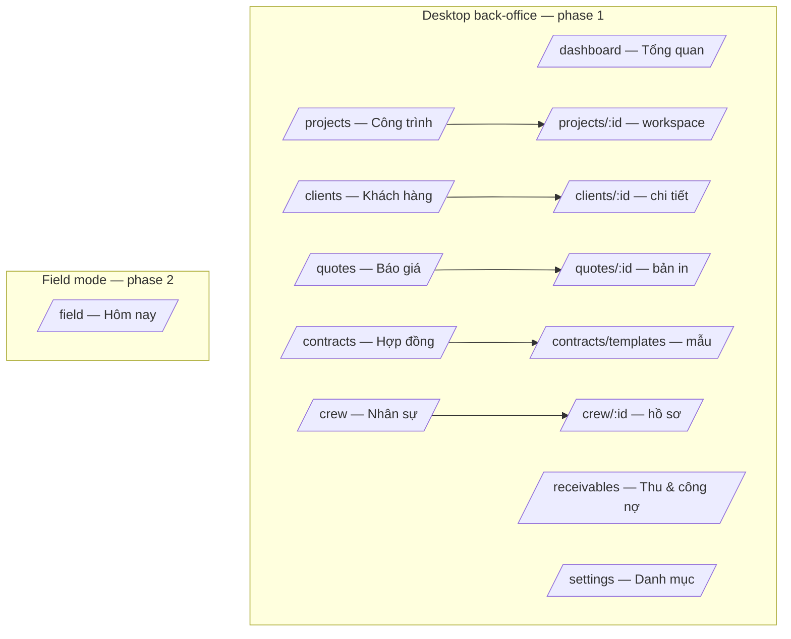

# CRM UI Redesign — v2 GreenOrange

Design spec for rebuilding `apps/crm-web` against the v2 backend
(`apps/crm-api-nest`). Companions: `crm-business-flow.md` (what the business
does) and `crm-database-schema.md` (the contract + EN↔VN glossary).

**Status: stage design pass COMPLETE, backend deltas APPLIED
(2026-07-23).** All stage panels confirmed one by one (sections below);
the Backend-deltas migration + module changes are live in `crm-api-nest`.

**2026-07-25 — pipeline is 8 stages, BUILT:** Yêu cầu + Khảo sát merged into
one "Yêu cầu & Khảo sát" panel (the appointment _is_ the survey visit). Panels
renumbered below; implemented in both apps — see "Stage merge delta" and
phase 7 in `crm-ui-implementation-plan.md`.

**2026-07-29 — mock mode is gone.** The build phases below were designed and
verified against bundled fixtures under `src/data/mock/`; Phase 6 of
`docs/fixes/v2-business-flow/` deleted them, so `CRM_API_URL` is now required and
the dev dataset is `apps/crm-api-nest`'s seed. Read any "mock mode" wording below
as "against seeded data".

Next: frontend build phase 1 (contract layer). Non-stage screens
(dashboard, clients, crew, receivables) carry the baseline spec and get
refined during build.

**Decisions (2026-07-23):**

1. Project detail = **guided stage workspace** (stepper + current-stage panel
   with gates), not flat entity tabs. _Superseded 2026-10-05 by the three-pane
   record — see "The Công Trình workspace" below; still guided, still no flat
   entity tabs._
2. **Two explicit modes**: full desktop back-office (phase 1) + compact mobile
   "field mode" for the boss on site (phase 2).
3. **No new visual identity** — keep `@yan/ui` components, Tailwind v4 tokens,
   light/dark. The redesign is information architecture + v2 contract.

## Principles

- **The pipeline is the common flow, not the only one.** The 8 stages are how
  a typical job progresses, but work happens opportunistically — clients,
  quotes, contracts, crew are created directly from their own pages, and jobs
  can be entered mid-pipeline (backfill). Every screen still answers "what
  does this job need next?"
- **Stages auto-advance from the work; they don't gate it.** Doing the thing
  moves the stage forward — creating a quote sends the project to Báo giá —
  forward-only (`stage = max(stage, triggered)`, never dragged backward). The
  panel's checklist shows what the current stage needs; when satisfied the
  project advances on its own. Manual stage moves stay possible with a soft
  warning — no hard 400 blocks.
- **Vietnamese in the UI, English in the code.** Enum values come from the v2
  API in English; `labels.ts` (regenerated from the glossary) is the only
  place Vietnamese labels live.
- **Zero-friction stage 1.** Client calls → appointment logged in under 30
  seconds, from dashboard or field mode (quick-create client/contact inline).
- **Derived, never stored.** Overdue milestones, timekeeping totals, overlap
  warnings — computed for display, exactly like the backend does.
- **Print is a first-class output.** Quotes, contracts, settlements, bills all
  render through `DocumentShell` (kept as-is).
- **Pages, not dialogs** (2026-07-23). Creating or editing a real entity
  (project intake, client, quote, contract, settlement, crew member) is a
  dedicated page/route or an inline form on the detail page — never a
  multi-field modal, never a nested modal-in-modal. Dialogs are reserved
  for tiny confirms: Hủy reason, a date pick, a status flip.

## Information architecture


```mermaid
flowchart TB
  subgraph desktop [Desktop back-office — phase 1]
    DASH[/dashboard — Tổng quan/]
    PROJ[/projects — Công trình/] --> PDET[/projects/:id — workspace/]
    CLI[/clients — Khách hàng/] --> CDET[/clients/:id — chi tiết/]
    QUO[/quotes — Báo giá/] --> QDET[/quotes/:id — bản in/]
    CON[/contracts — Hợp đồng/] --> CTPL[/contracts/templates — mẫu/]
    REC[/receivables — Thu & công nợ/]
    CREW[/crew — Nhân sự/] --> CRDET[/crew/:id — hồ sơ/]
    SET[/settings — Danh mục/]
  end
  subgraph field [Field mode — phase 2]
    TODAY[/field — Hôm nay/]
  end
```

Sidebar order: Tổng quan · Công trình · Khách hàng · Báo giá · Hợp đồng ·
Thu & công nợ · Nhân sự · Danh mục.

**Deleted from nav and disk:** `leads/`, `deals/`, `tasks/`, `contacts/`
route folders (v1 generic CRM, already unlinked), `formatUSD`, the old
Costs tab on project detail (Cost module is its own future design session
— until then costs simply don't appear in the UI).

**Kept:** `DocumentShell` + `SignatureBlocks`, `formatVND` / `formatDate` (now
`src/utils/format-vnd/` + `src/utils/format-date/`), `src/utils/vnd-in-words/`,
the Lexical contract-template editor, `force-dynamic` on the dashboard layout, the
`CRM_API_URL` seam — one env var picks which backend every page reads from.
**Dropped pattern:** v1's everything-in-a-modal forms — see "Pages, not dialogs"
below.

## The Công Trình workspace (`/projects/:id`)

**Decision 2026-10-05 — the three-pane record (option C).** The old shell
(header + stepper with "Chuyển sang" buttons + read-only "điều kiện" card +
current-stage panel + five read-only tabs) answered "what now?" in four places
that disagreed. It is replaced by one record: stage nav | the viewed stage's
work | context. Built in `apps/crm-web/src/app/(dashboard)/projects/[id]/`
(`page.tsx`, `stage-nav/`, `stage-panel/`, `future-stage-preview/`,
`context-pane/`, `documents-view/`, `workspace-header/`).

```text
┌──────────────────────────────────────────────────────────────────────────┐
│ CT-2026-014  Vệ sinh kính & sơn mặt tiền  [Đang hoạt động]               │
│ Highlands Coffee · 12 Lê Lợi · Anh Minh (0909…)  [Vệ sinh] [Thi công]    │
│        [Hoãn] [Hủy] [Chuyển giai đoạn…] [✎ Sửa]                          │
├──────────────┬──────────────────────────────────────┬────────────────────┤
│ ✓ Yêu cầu    │ GIAI ĐOẠN 3 · HỢP ĐỒNG               │ LIÊN HỆ            │
│ ✓ Báo giá    │ Việc cần làm            Còn 1 việc   │ Anh Minh  [Gọi]    │
│ ● Hợp đồng   │ ✓ Báo giá đã chốt                    │ Chị Lan (duyệt/ký) │
│ ◐ Hồ sơ 2/5  │ ✓ Khách ký xác nhận        04/10     │ TIỀN               │
│ ○ Thi công   │ ○ Nhận cọc (tạm ứng) [Ghi nhận cọc]  │ 0 / 48.500.000 ₫   │
│ ○ Nghiệm thu │   → Xong việc này → tự chuyển sang … │ ▱▱▱▱▱▱▱▱           │
│ ○ Quyết toán │                                      │ SẮP TỚI            │
│ ○ Đã đóng    │ Hợp đồng (không bắt buộc)            │ 08/10 PCCC chờ BQL │
│ ──────────── │ HD-2026-007 · Đã ký   [Mở]           │ GHI CHÚ & HOẠT ĐỘNG│
│ Giấy tờ (3)  │                                      │ [ Thêm ghi chú… ]  │
│ Nhân sự (4)  │                                      │ 04/10 Khách ký…    │
└──────────────┴──────────────────────────────────────┴────────────────────┘
```

- **Header.** Code, name, status badge, client · location · contacts, type
  tags. Exception actions stay **visible buttons** — Hoãn / Dời ngày hẹn
  (follow-up date), Hủy (reason required), Kích hoạt lại (when frozen), Sửa
  (inline edit) and **Chuyển giai đoạn…** — no hidden ⋯ menu, because the
  operators are not tech-savvy. Chuyển giai đoạn… is the only manual stage
  move: a small dialog with a stage select (a closed job offers only Quyết
  toán & Thanh toán — the server's reopen rule) and the current stage's open
  rows listed as a soft warning ("Còn N việc ở … — các việc này vẫn hiện để
  làm sau"). Hidden while the job is on hold or cancelled; the frozen banner
  stays.
- **Left — stage nav.** All 8 stages, every one openable, then Giấy tờ (all
  documents of the job) and Nhân sự (assignments). Marker per stage, colour
  per "Buttons vs badges": **done** blue check · **current** purple number ·
  **leftover** amber "!" (a past stage with open rows, after a manual move) ·
  **parallel** half-filled purple (Hồ sơ while at Hợp đồng with items under
  way) · **future** grey number. Each item has a one-line summary ("2/3 việc",
  "Xong"). The selected item is neutral (background + border,
  `aria-current="page"`), never green. Below `lg` the same list becomes a
  horizontal chip row (rounded rectangles, short labels from
  `STAGE_SHORT_LABELS`).
- **Centre — the viewed stage.** `?view=<stage>|documents|crew` (Next 16
  `searchParams`, parsed by `utils/parse-view`; unknown values fall back),
  default = the current stage; only that view's data is fetched. Links are
  built by `utils/view-href` (the current stage's link has no `?view=`).
  - Current or **past** stage → that stage's own panel, its "Việc cần làm"
    checklist on top (corrections and leftover rows still work).
  - **Future** stage → `FutureStagePreview`: the stage's rows, no buttons,
    "Chưa tới giai đoạn này. Mở khi …" (`STAGE_OPENS`).
  - Exception: **Hồ sơ while at Hợp đồng** renders the full panel — paperwork
    is prepared in parallel.
  - A **closed** job's past stages render read-only (native
    `<fieldset disabled>` + "chỉ xem — mở lại ở giai đoạn Đã đóng"), since the
    server 409s every edit on a closed project.
- **Right — context pane.** Liên hệ (working contact, decision maker, phone +
  Gọi, location) · Tiền (giá trị = official bill › chốt quote › latest quote;
  đã thu; còn lại; blue progress bar; red "Quá hạn N ngày" badge) · Sắp tới
  (appointment before the visit, submitted hồ sơ with a due date, unpaid đợt
  with a due date) · Ghi chú & hoạt động (add note + list). Below `lg` it
  stacks under the centre pane.
- **Removed:** the stepper and its "Chuyển sang / ←" buttons, the read-only
  `StageGates` card, and the five read-only tabs (Báo giá, Hồ sơ, Nhân sự,
  Thanh toán, Ghi chú & tệp) — their content lives in the stage views, Giấy
  tờ, Nhân sự and the context pane.

### Panel action grammar (2026-09-09; gate = task 2026-10-05)

Every panel had invented its own placement: the stage exit sat bottom-left
alone in stages 1 and 5, mid-card among the secondaries in 6 and 7, and was
`size="sm"` in 2 and 7 — so the one button that moves the job forward was
never in the same place twice. Operators could not tell an advance from a
print link. The rules below are binding for all eight panels; where a
per-stage ASCII mockup in this document disagrees, the mockup predates them.

1. **The checklist is the next step (changed 2026-10-05).** Each stage card
   opens with its "Việc cần làm" checklist (`GateChecklist`, rows from
   `utils/stage-gates`). Every row carries the action that completes it. The
   first open row that has an action available (`utils/next-gate`) holds the
   stage's **single primary** — green, default size, the row tinted purple;
   every other row action is `outline sm` (`utils/gate-button-props`). Under
   that row, "Xong việc này → tự chuyển sang …" appears only when the row is
   an auto-advance trigger (`advances`) **and** the last open row — the
   promise is never wrong. _Was: footer = the stage's next step (2026-09-09)._
2. **Footer = stage-level secondaries only.** Print the stage letters
   (Nghiệm thu), reopen / "+ Công trình mới tại địa điểm này" (Đã đóng).
   Never the next step any more.
3. **Header = status, or the list's add.** `StageCard`'s `aside` takes a badge
   or a count, and lives outside the `h2` so a button is never part of the
   heading. Section (`h3`) headers keep `justify-between` with at most one
   `outline sm` add on the right. Never a primary in a header.
4. **Body rows right-align their own actions** (`ml-auto`, `outline sm`).
   A text delete is `destructive sm`; an icon-only delete is `ghost icon-sm`
   with an `aria-label` naming its target.
5. **Sub-status transitions form one row directly under their progress strip**,
   `outline sm`, transitions only — no edit/print/delete mixed in. The
   transition that _leaves_ the stage is not in the row; it is the
   checklist row's action.
6. **Field saves are `outline sm`** at the end of the field row they commit.
7. **Dialog footers are Đóng (`outline`) then the confirm** (default, or
   `destructive` when it destroys) — what `ConfirmAction` already renders.
8. **A verb keeps its variant everywhere.** Hủy / Xóa / Xóa nháp →
   `destructive`. Hoãn / Sửa / In / Xem bản in / Gửi lại → `outline`. A print
   button carries the `Printer` icon.

Row actions (2026-10-05): Yêu cầu — `VisitAction` (Đã gặp khách) → `SurveyExit`
(a plain link to the builder; creating the quote moves the stage). Báo giá —
link to the builder → `QuoteDecision` (Gửi, then Chốt; Gửi lại/Hoãn outline,
Hủy destructive). Hợp đồng — `RecordClientSigned`, `RecordDeposit`. Hồ sơ —
`RecordDeposit` while the cọc is missing (the item table is the hồ sơ work).
Thi công — `FinishConfirm`. Nghiệm thu — Đạt (while inspecting). Quyết toán —
link to create → `SettlementAdvance` (Đã gửi / Đã ký). Shared actions live in
`components/gate-actions/`.

### Buttons vs badges — green means "bấm vào đây" (2026-10-05)

Operators are not tech-savvy: they must tell _what can I press_ from _what is
just information_ at a glance, without reading. So colour and shape each carry
one meaning, everywhere in crm-web. Binding for all new and touched UI.

**Status (2026-10-05): fully applied.** The status tokens (`--done` / `--now` /
`--waiting` / `--problem` + `-soft`, Tailwind `text-done`, `bg-now-soft`, …) live
in `packages/ui/src/styles.css` next to the `Badge` that uses them; use them,
never raw palette classes. `Badge` variants map to the tones — `default` purple,
`secondary` grey, `warning` amber, `success` blue, `destructive` red, `outline` a
dot-less grey tag — and every status tone leads with a dot. `labels.ts` was
remapped so each label means its tone: every open **stage** is `default`
("happening now"), only Đã đóng is `success` (this replaces the old plan-00
phase colouring, which painted Quyết toán as finished and Hợp đồng as
waiting); Đang hoạt động / Đang làm are purple; Gửi yêu cầu (nghiệm thu) and a
sent quyết toán are amber (waiting on the client). No raw green/emerald class
is left in crm-web (merge chips and links on the paper sheet are zinc; saved
ticks are blue). `apps/web` does not use `Badge`.

1. **Green is only for primary buttons.** The primary button is always solid
   green (`--primary`) with white text. One green button per working area: the
   next step. Nothing else is ever green: not badges, not text, not icons, not
   done-ticks, not progress bars, not row highlights, not active nav.
2. **Buttons are rounded rectangles that say a verb.** "Ghi nhận cọc",
   "Gửi qua Zalo". `rounded-md`, never `rounded-full`. Three kinds only:
   - **Primary** — solid green. The step that moves the job.
   - **Secondary** (`outline`) — white with a visible border and shadow. In,
     Sửa, Gửi lại, Gọi, Zalo.
   - **Danger** (`destructive`) — red. Hủy, Xóa.
     A `ghost` text button is allowed only for an alternative path next to a
     primary ("Khách trả giá → lập v3"), and is underlined on hover.
3. **Badges are pills that say a state.** "Đã duyệt", "Chờ thanh toán".
   `rounded-full`, no border, soft tint, a leading dot, never clickable, never
   a verb. Fixed tones — a meaning never borrows another tone:

   | Tone   | Meaning                                                 | Examples                                                      |
   | ------ | ------------------------------------------------------- | ------------------------------------------------------------- |
   | Grey   | not started / inactive                                  | Nháp, Chưa xong, Đã thay thế, Chưa tới                        |
   | Purple | happening now                                           | Đang hoạt động, Đang làm, Song song                           |
   | Amber  | waiting on someone / leftover / heads-up (non-blocking) | Chờ duyệt, Đã nộp, Chờ thanh toán, Hoãn, Còn việc, Trùng lịch |
   | Blue   | done                                                    | Đã duyệt, Đã ký, Chốt, Đã thu, Chính thức                     |
   | Red    | problem                                                 | Quá hạn, Hủy                                                  |

4. **Non-badge status marks use the badge tones**: done ticks and finished
   stage markers are blue, the current stage marker is purple, leftover work is
   amber, progress bars fill blue.
5. **Shape never lies.** No pill-shaped control (a stage switcher chip is a
   rounded rectangle) and no rectangular status. Plain tags (project types)
   are grey pills without the dot.
6. **Words first, colour second.** Every state is written out; colour only
   reinforces it. A disabled button keeps its shape and says why next to it
   ("Làm dòng trên trước").

Reference mockup: the "Hồ sơ công trình" (option C) artifact from the
2026-10-05 project-flow redesign.

### Per-stage panels (first-pass draft — each stage confirmed below, one by one)

> **2026-10-05:** each stage's exit now lives in its "Việc cần làm" checklist
> row (see "Panel action grammar"), not the card footer, and the stepper /
> read-only tabs are gone. The per-stage mockups below predate that; read their
> footer buttons as checklist rows.

Auto-advance = the server moves the job forward (forward-only `max` rule,
`crm-api-nest/src/common/stage.ts` + twin `crm-api/app/core/rules.py`); a
manual move is always allowed via Chuyển giai đoạn….

| #   | Stage                   | Panel contents                      | Leaves the stage when (soft, forward-only)                                               |
| --- | ----------------------- | ----------------------------------- | ---------------------------------------------------------------------------------------- |
| 1   | Yêu cầu & Khảo sát      | ✅ confirmed — see "Stage 1" below. | first quote created → 2                                                                  |
| 2   | Báo giá                 | ✅ confirmed — see "Stage 2" below. | a quote decided `deal` (chốt) → 3                                                        |
| 3   | Hợp đồng                | ✅ confirmed — see "Stage 3" below. | cọc paid (`deposit` milestone `paid`) → 4                                                |
| 4   | Chuẩn bị hồ sơ          | ✅ confirmed — see "Stage 4" below. | every `needed_for: execution` item `approved` + cọc paid → 5                             |
| 5   | Thi công                | ✅ confirmed — see "Stage 5" below. | works-done confirm (`FinishConfirm` PATCHes the stage, client-side) → 6                  |
| 6   | Nghiệm thu              | ✅ confirmed — see "Stage 6" below. | sub-status `passed` (Đạt) → 7; creating the settlement also → 7                          |
| 7   | Quyết toán & Thanh toán | ✅ confirmed — see "Stage 7" below. | settlement signed and fully paid (bill `paid` or every đợt `paid`) → 8, bill marked paid |
| 8   | Đã đóng                 | ✅ confirmed — see "Stage 8" below. | terminal (reopen → stage 7)                                                              |

### Stage 1 — Yêu cầu & Khảo sát (confirmed 2026-07-23; entry decoupled 2026-07-24; merged 2026-07-25)

**A project does not have to start as a request.** `/projects/new` is one
create page with a **starting-stage selector** (default `Yêu cầu`), reached
by two buttons with different defaults:

- Dashboard **"+ Tiếp nhận yêu cầu"** → starts at Yêu cầu, appointment
  prefilled today — the zero-friction stage-1 path.
- Projects list **"+ Công trình mới"** → stage selector visible, no
  appointment prefill — direct create + **backfilling pre-CRM projects**
  that are already mid-pipeline (or finished).

Only the Công Trình identity is **always required** — Client · Location ·
Type · Name. The stage-1 fields (**Hẹn gặp**, **Yêu cầu**, **Nguồn**) are
**conditional**: shown/required only when the starting stage is Yêu cầu,
hidden/optional otherwise. One submit creates the project at the chosen
stage and lands on its workspace.

```text
┌─ /projects/new · Tiếp nhận yêu cầu ────────────┐
│ Giai đoạn     [Yêu cầu ▾]  ← default; hides     │
│                             stage-1 fields when  │
│                             set to a later stage │
│ Khách hàng    [search… ▾]  (+ tạo nhanh)       │
│ Người liên hệ [auto from client ▾] (+ tạo nhanh)│
│ Địa điểm      [auto from client ▾] (+ tạo nhanh)│
│ Loại          [Vệ sinh] [Thi công] [Tháo dỡ]   │
│ Tên công trình [___________] (gợi ý tự động)   │
│ Yêu cầu       [mô tả ngắn___________________]  │ ← stage-1 only
│ Nguồn         [giới thiệu / gọi lại / …______] │ ← stage-1 only
│ Hẹn gặp       [Hôm nay ▾] [15:00]              │ ← stage-1 only
│                              [Tạo công trình]  │
└────────────────────────────────────────────────┘
```

- Client is search-first (repeat clients are the norm); "tạo nhanh"
  expands an inline section on the same page (name + type only — details
  later), never a nested modal. Picking a client auto-fills most-recent
  contact + location; individuals skip contact/location (backend
  auto-creates).
- Name auto-suggested "{type} {location}", editable.
- **Yêu cầu** = short request description (`request_note`).
- **Nguồn** = referral source (`referral_source`), free text — not a managed
  list (YAGNI).
- Appointment defaults to today; time required (drives the dashboard's
  "Hôm nay" block).
- **Backfill fidelity**: create at the real current stage, then back-date
  via the workspace's existing edit affordances (`visit_date` sửa, start/end
  dates, money on bills/milestones). No back-date fields on the create form
  itself — reuse what the workspace already has.
- **Creating at a stage asserts state, it does not transition** — the
  forward-move gates (chốt quote, cọc, paperwork approved…) are **not run on
  create**, so a backfilled stage-5 job doesn't 400 on gates it never passed
  through in-app. Auto-seed paperwork still fires (harmless).
- Backfilling an already-**finished** job hits the stage-8 close lock:
  create at stage 7, or reopen to edit.
  `// ponytail: revisit if backfilling closed jobs becomes common`

**Stage-1 panel** — one panel, two halves. The survey half is **revealed by
`visit_date`**, not by a stage move: before the visit it's the appointment
card alone, after the [Đã gặp khách] tap the measurement/notes/photos section
appears below it.

Before the visit:

```text
┌ GIAI ĐOẠN 1 · YÊU CẦU & KHẢO SÁT ──────────────┐
│ Yêu cầu: "Vệ sinh kính mặt ngoài toà A"        │
│ Nguồn: giới thiệu (chị Hoa)                    │
│ 📅 Hẹn gặp: Hôm nay 15:00 · Toà nhà A [Dời hẹn]│
│                                                │
│ [✓ Đã gặp khách — bắt đầu khảo sát]            │
└────────────────────────────────────────────────┘
```

- **Dời hẹn** edits `appointment_at` in place — no reschedule history.
- The button sets `visit_date` (today, editable) and **stays in stage 1** —
  it reveals the survey half, it no longer moves the stage.
- No stage-specific cancel: no-show/dead lead uses the header's global
  **Hủy** (reason required).

After the visit (same panel, survey half added):

```text
┌ GIAI ĐOẠN 1 · YÊU CẦU & KHẢO SÁT ──────────────┐
│ Yêu cầu: "Vệ sinh kính mặt ngoài toà A"        │
│ 📅 Hẹn gặp: 23/07 15:00 · Toà nhà A            │
│ Đã gặp khách: 23/07/2026  [sửa]                │
│ ─────────────────────────────────────────────  │
│ Hạng mục đo đạc                    [+ Thêm dòng]│
│ ┌ Hạng mục          │ SL   │ ĐV │ Ghi chú ────┐│
│ │ Kính mặt ngoài    │ 320  │ m² │ tầng 12–18  ││
│ │ Kính sảnh         │  45  │ m² │             ││
│ └───────────────────┴──────┴────┴─────────────┘│
│                                                │
│ Ghi chú khảo sát (giờ làm, an toàn, tiếp cận…) │
│ ┌────────────────────────────────────────────┐ │
│ │ cần dây đu, giờ làm 6h–9h sáng…            │ │
│ └────────────────────────────────────────────┘ │
│                                                │
│ Hình ảnh (3)                       [+ Thêm ảnh]│
│  · mat-ngoai-1.jpg — "vết ố tầng 15"           │
│                                                │
│ [✓ Đủ dữ liệu — lập báo giá]                   │
└────────────────────────────────────────────────┘
```

- **Measurement rows** (`survey_items`, JSON on Project: `{name, quantity,
unit, note}[]`) — inline-editable rows; they **prefill quote line items**
  (name → description, quantity + unit carried over, price left empty).
- **One free-text note** (`survey_note`) for everything else: access hours,
  safety constraints, site conditions.
- **Photos: metadata-only is fine for launch** — attachments record
  filename + note, actual files stay on the phone/Zalo until the S3
  session. No upload work pulled forward.
- Exit button moves to stage 2 **and** navigates to the quote-builder page
  prefilled from the measurement rows.

### Stage 2 — Báo giá (confirmed 2026-07-23)

**Panel = versions rail**, latest on top carrying the live status; older
versions frozen as "Đã thay thế" with their printable kept:

```text
┌ GIAI ĐOẠN 2 · BÁO GIÁ ─────────────────────────┐
│ BG-2026-012 · v2   [Chờ duyệt]    36.000.000₫  │
│   Gửi: Zalo 23/07 (Thư ký) · In 23/07          │
│   [Chốt ✓] [Hoãn] [Hủy]   [Gửi lại] [Tạo v3]   │
│   [Xem bản in]                                 │
│ ────────────────────────────────────────────── │
│ v1 · Đã thay thế · 40.000.000₫    [Xem bản in] │
└────────────────────────────────────────────────┘
```

Per-state actions on the latest version:

- **Nháp** — [Sửa] (builder page) · [Gửi] · [Xóa nháp]. Gửi is a tiny
  confirm (allowed dialog): channels Zalo/Email/In (multi-select → one
  `QuoteSendLog` row per channel) + who sent.
- **Chờ** — [Chốt]/[Hoãn]/[Hủy] · [Gửi lại] · [Sửa Báo giá này] =
  bargaining, copies the version into a new draft on the builder page.
- **Chốt** — panel turns green; "→ Sang giai đoạn Hợp đồng" becomes the
  primary button.

**Chained decisions (decision A, 2026-07-23):** [Hoãn] asks one question
("Hẹn theo dõi lại ngày nào?") then flips quote → `on_hold` AND project →
`on_hold` with that follow-up date. [Hủy] asks the reason once, flips
quote → `rejected` AND project → `cancelled` with that reason (prefilled
"Khách hủy báo giá v2"). Quote and project never disagree; no separate
parking chore.

**Quote builder page** (`/projects/:id/quotes/new`):

```text
┌ Lập báo giá · CT-2026-001 · v3 ─────────────────┐
│ Hạng mục            SL    ĐV   Đơn giá   T.tiền │
│ Kính mặt ngoài     320    m²   100.000   32tr   │
│ [+ Thêm dòng]                                   │
│ VAT [ 8 ]%   Tạm tính 36tr · Tổng 38,88tr       │
│ Điều khoản & ghi chú                            │
│ ┌─────────────────────────────────────────────┐ │
│ │ Báo giá hiệu lực 30 ngày. Chưa gồm…         │ │
│ └─────────────────────────────────────────────┘ │
│           [Lưu nháp]  [Lưu & gửi ngay]          │
└─────────────────────────────────────────────────┘
```

- Prefilled from survey rows (new quote) or the superseded version
  (bargaining). Totals display-side only — server recomputes,
  authoritative.
- **VAT exposed and editable** per quote, default 8% (`vat_rate`).
- **Điều khoản & ghi chú** = existing `Quote.note`, rendered as the terms
  block on the printable. **No backend deltas for stage 2.**

### Stage 3 — Hợp đồng (confirmed 2026-07-23)

```text
┌ GIAI ĐOẠN 3 · HỢP ĐỒNG ────────────────────────┐
│ Điều kiện hoàn thành                            │
│ ☑ Báo giá đã chốt         v2 · 36.000.000₫     │
│ ☐ Khách ký xác nhận       [Ghi nhận đã ký]     │
│ ☐ Nhận cọc (tạm ứng)      [Ghi nhận cọc]       │
│                                                 │
│ Hợp đồng (không bắt buộc)     [+ Tạo hợp đồng]  │
│ HD-2026-003 · Nháp   [Sửa] [In] [Đánh dấu đã ký]│
│                                                 │
│ ℹ Hồ sơ có thể chuẩn bị song song → Hồ sơ      │
└─────────────────────────────────────────────────┘
```

- **Ghi nhận đã ký** — date confirm (today default) → `client_signed_date`.
  Independent of any written contract, so quote-only jobs pass the gate the
  same way. **Date is the only evidence recorded** — no attachment slot.
- **Ghi nhận cọc** — amount + received date; creates the deposit milestone
  (`bill_id` null) and marks it `paid`. Amount varies job-to-job but
  **prefills at 60% of the chốt quote total** (UI-side computation).
- **Contract card** — 0..n contracts; create → the Lexical template-editor
  page (kept, merge fields from project + chốt quote); print via
  `DocumentShell`; "Đánh dấu đã ký" stamps `signed_date` (today default).
- **Chaining:** marking a contract Đã ký auto-sets `client_signed_date`
  (if empty) — both sides signing the contract IS the client confirmation.
  UI-orchestrated, same as stage-2 chaining.
- No backend deltas.

### Stage 4 — Chuẩn bị hồ sơ (confirmed 2026-07-23)

```text
┌ GIAI ĐOẠN 4 · CHUẨN BỊ HỒ SƠ ──────────────────┐
│ Hồ sơ (2/8 đã duyệt)                [+ Thêm mục]│
│                                                 │
│ Giấy phép thi công   ●──●──●  Đã duyệt          │
│ PCCC · hạn 30/07     ●──●──○  Đã nộp   [Duyệt]  │
│ Danh sách nhân sự    ●──○──○  Chưa xong [Nộp]   │
│   ↳ [Tạo từ phân công] (3 người đã phân công)   │
│ Danh sách thiết bị   ●──○──○  Chưa xong [Nộp] ✕ │
└─────────────────────────────────────────────────┘
```

- Rows: name, one-way single-tap status stepper (`Chưa xong → Đã nộp →
Đã duyệt`), expandable note + attachment (metadata). ✕ deletes.
- **Auto-seeded**: the 8 default items are created automatically with the
  project (backend delta — was a manual button). Zero-paperwork jobs just
  delete them (or ignore: gate is vacuous with zero items — "Không cần
  hồ sơ").
- **Due date** (`due_date`, optional) — permits have lead times and
  buildings forget. Overdue = derived (due date passed, not `approved`),
  shown as a red date chip here and in the dashboard's "Cần theo dõi"
  block.
- Who an item was submitted to lives in the per-item **note** — no extra
  field.
- **Danh sách nhân sự** row gets a "Tạo từ phân công" helper — renders a
  printable worker list (DocumentShell) from current assignments. No
  equipment model for Danh sách thiết bị (YAGNI).

### Stage 5 — Thi công (confirmed 2026-07-23)

```text
┌ GIAI ĐOẠN 5 · THI CÔNG ────────────────────────┐
│ Khởi công ●──● Dựng rào ──○ Thi công            │
│                    [→ Bắt đầu thi công]         │
│                                                 │
│ Bắt đầu: 25/07 · Dự kiến 10 ngày (→ 04/08) ⚠trễ │
│ Thực tế: [ 12 ] ngày (nhập tay)   │
│   Chấm công: 96 giờ / 11 ngày có ghi nhận  ⚠    │
│   [Xem chênh lệch]                              │
│                                                 │
│ Nhân sự (3)  · Trùng lịch: 1 ⚠   [Phân công]    │
│ Cách thức thi công: [dây đu, làm đêm…________]  │
│                                                 │
│ [✓ Xác nhận hoàn tất thi công]                  │
│    + ảnh hoàn công (tùy chọn, metadata)         │
└─────────────────────────────────────────────────┘
```

- **Sub-status stepper**, one-way, single tap. **Dựng rào is skippable**
  (indoor jobs): Khởi công → Thi công allowed directly. Each advance
  offers an _optional_ note → stored as a ProjectNote with the sub-status
  as context (shown in the context pane's notes), no per-step note columns.
- **Est end derived**: `start_date + est_duration_days`; "trễ" chip when
  today is past it and works aren't done.
- **Duration dual-sourced, no hard conversion rule**: manual
  `actual_duration_days` = source of truth; timekeeping shown as-is
  (total hours + distinct recorded days). Disagreement → ⚠ +
  [Xem chênh lệch] modal (comparison view — allowed dialog) with per-day
  records; she resolves by editing either side. No 8h=1-day math —
  invented rules create fake conflicts.
- Worker list = assignment summary (count + overlap chip), editing in the
  workspace's Nhân sự view (`?view=crew`). Approaches = free text
  (`approaches`).
- Exit stamps `works_done_at` → stage 6; optional image-log attachments.

### Stage 6 — Nghiệm thu (confirmed 2026-07-23)

```text
┌ GIAI ĐOẠN 6 · NGHIỆM THU ──────────────────────┐
│ Gửi yêu cầu ●──● Nghiệm thu ⇄ Bổ sung ──○ Đạt   │
│                                                 │
│ Trạng thái: Đang nghiệm thu                     │
│ [Khách báo lỗi → Bổ sung]    [✓ Đạt — ký BB]    │
│                                                 │
│ Lịch sử: 24/07 Bổ sung — "ố kính tầng 15"       │
│          25/07 Nghiệm thu lại                   │
│                                                 │
│ [In thư yêu cầu nghiệm thu]                     │
│ Biên bản nghiệm thu: (đính kèm khi Đạt)         │
└─────────────────────────────────────────────────┘
```

- Entering stage 6 sets `request_sent` automatically — the stage starts by
  requesting; no extra tap.
- **Formal printable request** — [In thư yêu cầu] renders a DocumentShell
  letter (letterhead, signature blocks) listing the three asks: lịch
  nghiệm thu, biên bản nghiệm thu, hình ảnh hoàn công.
- Transition buttons: "Khách đã hẹn lịch" (→ inspecting) · "Khách báo lỗi
  → Bổ sung" (→ rework, **note required** — what the client found) ·
  "Bổ sung xong — nghiệm thu lại" (→ inspecting) · "Đạt" (→ passed,
  **stamps `acceptance_passed_date`**, unlocks stage 7). Notes land in
  the ProjectNote timeline; the rework history shown is those notes
  filtered.
- Signed biên bản = attachment (metadata) on Đạt.

### Stage 7 — Quyết toán & Thanh toán (confirmed 2026-07-23)

**One quyết toán per công trình** (1:1, 2026-07-25 — replaces the earlier
"settling happens in phases" list). The panel is a single settlement card
owning its bill and that bill's milestones:

```text
┌ GIAI ĐOẠN 7 · QUYẾT TOÁN & THANH TOÁN ─────────┐
│ QT #4                     Nháp ─● Đã gửi ─○ Ký  │
│   38.500.000₫  [Sửa] [In] [Đã gửi] [✓ Đã ký]    │
│   ② Hóa đơn HĐ #4 · Nháp (chính thức khi ký)    │
│      [In đề nghị thanh toán] [Đã gửi] [Đã thu]  │
│   ③ Đợt thanh toán                  [+ Thêm đợt]│
│      Tạm ứng (cọc)  21,6tr · Đã thu 23/07 ✓     │
│      Đợt cuối       16,9tr · hạn 15/08 ⚠Quá hạn │
│                     [Ghi nhận đã thu]           │
│                                                 │
│ Toàn công trình: Đã thu 21,6tr / 38,5tr         │
│           (signed: [Sửa lại (bỏ ký)] on card)   │
└─────────────────────────────────────────────────┘
```

`[+ Quyết toán]` shows only while the project has none.

- **Settlement builder page** ([Soạn quyết toán] / [Sửa], drafts only) —
  **line-items editor prefilled from the chốt quote's items**; quantities
  adjusted to khối lượng thực tế, rows addable/removable. Server computes
  amounts/total (mirror of the quotes module). Printable via
  DocumentShell.
- **"Khách đã ký"** (one action, backend transaction): stamps
  `signed_date`, flips the bill **Chính thức** with total = settlement
  total, **attaches the unallocated cọc milestone to this first bill**,
  and **auto-creates one milestone for the remaining balance** (bill −
  cọc) — she can then split it into đợt with [+ Thêm đợt] or edit dates.
- **"Sửa lại (bỏ ký)"** (signed cards only, 2026-07-25) — the correction
  path now that there's one quyết toán per project: reverts the sign
  transaction (bill → Nháp, unpaid đợt dropped, cọc kept) so the numbers
  can be edited and re-signed. Hidden/refused once money has come in on
  the bill.
- **Hóa đơn**: forward-only manual flips, dates default today. Printable
  = internal "Đề nghị thanh toán"; the real VAT e-invoice lives outside
  the CRM.
- Quá hạn derived (due date passed, unpaid), red chip here + dashboard +
  `/receivables`.
- Gate to Đã đóng: the bill + all milestones paid (server-enforced).

### Stage 8 — Đã đóng (confirmed 2026-07-23)

```text
┌ GIAI ĐOẠN 8 · ĐÃ ĐÓNG ─────────────────────────┐
│ ✓ Hoàn thành · Đã thu đủ 38.500.000₫            │
│                                                 │
│ Hẹn gặp 20/07 → Đóng 20/08 (31 ngày)            │
│ Thi công: 12 ngày · Nghiệm thu: 1 lần bổ sung   │
│ Tài liệu: Báo giá v2 · HD-003 · QT-004 · BB NT  │
│                                                 │
│ [+ Công trình mới tại địa điểm này]   [Mở lại]  │
└─────────────────────────────────────────────────┘
```

- Read-only recap from existing data: date stamps (`visit_date`,
  `works_done_at`, `acceptance_passed_date`), money from bills/milestones,
  links to all printables. No new fields.
- **Locked on close**: entities of a closed project reject edits (server-
  enforced); viewing/printing always works, notes stay allowed. **[Mở
  lại]** returns the project to stage 7 and unlocks — the correction is
  then made on the project's single quyết toán ([Sửa lại (bỏ ký)]).
- **[+ Công trình mới tại địa điểm này]** — repeat-business shortcut:
  opens intake prefilled with this client/location/contacts; a completely
  separate new Công Trình.

## Backend deltas — ✅ APPLIED 2026-07-23 (migration `20260723142049_ui_design_deltas`)

| Model          | Change                                                                                                                                                                                                               | From stage |
| -------------- | -------------------------------------------------------------------------------------------------------------------------------------------------------------------------------------------------------------------- | ---------- |
| Project        | `request_note String?`                                                                                                                                                                                               | 1          |
| Project        | `referral_source String?`                                                                                                                                                                                            | 1          |
| Project        | `survey_items Json?` — `{name, quantity, unit, note}[]` (scratch input for quote prefill; JSON, not a table — never queried across projects)                                                                         | 1          |
| PaperworkItem  | `due_date DateTime? @db.Date` — overdue derived, never stored                                                                                                                                                        | 4          |
| (behavior)     | `POST /projects` auto-creates the 8 default paperwork items (replaces the manual `/paperwork-items/defaults` call; endpoint can stay for re-seeding)                                                                 | 4          |
| (behavior)     | `execution_sub_status`: allow `kickoff → works` directly (Dựng rào skippable) — verify current PATCH validation permits it                                                                                           | 5          |
| Project        | `acceptance_passed_date DateTime? @db.Date` — stamped on sub-status → `passed`                                                                                                                                       | 6          |
| SettlementItem | new table mirroring QuoteItem (`settlement_id`, `description`, `unit`, `quantity`, `unit_price`, `amount`, `sort_order`) — prefilled from quote items, quantities adjusted to actuals; server computes amounts/total | 7          |
| Settlement     | `total_amount BigInt` (server-computed from items; copied to bill on sign)                                                                                                                                           | 7          |
| (behavior)     | on settlement sign: attach unallocated cọc milestone (`bill_id` null, paid) to the new official bill + auto-create one milestone for the remaining balance                                                           | 7          |
| (behavior)     | closed projects are locked: mutations on the project + its entities rejected (except ProjectNote and the reopen action `stage: closed → settlement`)                                                                 | 8          |

## Backend deltas — ✅ APPLIED 2026-07-24 (migration `20260724050124_soft_gates_auto_advance_standalone`)

Entry decoupled from stage 1; gates are soft auto-switches, not hard rejects;
standalone quotes/contracts. Live in `crm-api-nest` (shared `advanceStage`
helper in `src/common/stage.ts`; `checkStageGate` removed):

| Model / behavior | Change                                                                                                                                                                                                                                                                       | From |
| ---------------- | ---------------------------------------------------------------------------------------------------------------------------------------------------------------------------------------------------------------------------------------------------------------------------- | ---- |
| (behavior)       | `POST /projects` accepts optional `stage` (default `yeu_cau`); creating at a stage **asserts state** and does NOT run forward-move gates (direct create / pre-CRM backfill)                                                                                                  | 1    |
| (behavior)       | stage transitions become **auto-advance, forward-only** — `stage = max(stage, triggered)` on the artifact action (quote → 2, cọc → 4, works-done → 6, settlement signed → 7…). No gate 400s; manual moves allowed (soft warning). Replaces the server-enforced gate rejects. | all  |
| Quote            | `project_id` **nullable** — standalone quotes (walk-in / speculative), attachable to a project later; attaching auto-advances that project to Báo giá                                                                                                                        | 2    |
| Contract         | `project_id` **nullable** — standalone contracts; attaching auto-advances that project to Hợp đồng                                                                                                                                                                           | 3    |

The stage-8 **closed-project lock stays** (it's an edit lock, not a transition gate); only the _trigger_ to close (final payment) becomes auto/soft like the rest.

**Frontend (2026-07-24):** `/quotes` gains "+ Báo giá mới" → `/quotes/new`
(reuses the quote builder with an optional project picker; standalone → quote
detail, picked → project workspace + auto-advance). `/contracts` gains
"+ Hợp đồng mới" → `/contracts/new` (project picker → the existing
project-scoped editor). Standalone list rows show "—" for no project.
Deferred: project-_less_ contract authoring (the editor's live preview merges
project/client/quote data) — backend accepts null, UI comes on real need.

## Stage merge delta — ✅ APPLIED 2026-07-25

`request` + `survey` → one `request` stage (migration
`20260725000000_merge_request_survey_stage`; see `crm-database-schema.md`).
Full file list + findings in `crm-ui-implementation-plan.md` phase 7. Shape as
built:

| Piece                               | Change                                                                                                                                   |
| ----------------------------------- | ---------------------------------------------------------------------------------------------------------------------------------------- |
| `panels/request.tsx`                | renders the appointment half, then `{project.visit_date ? <SurveyPanel/> : <đã-gặp-khách input>}` — no new component, no rewritten panel |
| `panels/survey.tsx`                 | now a **bare body** (dispatcher-free, like `ContractPanel`); keeps its own "Đã gặp khách: … [sửa]" row and its `stage: quote` exit       |
| `panels/request.tsx` [Đã gặp khách] | PATCHes `{visit_date}` only — the stage move is gone                                                                                     |
| `stage-panel.tsx`                   | `survey` case deleted; contract case's hardcoded "Giai đoạn 4" now computed                                                              |
| `stage-stepper.tsx`                 | 8 steps + "n/8" pill came free from `PROJECT_STAGE_ORDER` — untouched                                                                    |
| `/dashboard` + `/field` "Hôm nay"   | filters gained `!visit_date` — a visited job now **stays** in stage 1, so the stage alone no longer means "still to meet"                |
| `/field`                            | "Bắt đầu khảo sát" stops moving the stage, same `{visit_date}`-only PATCH                                                                |

`ponytail: two stacked halves in one panel, not a rewritten merged panel — the survey UI is already built and correct`

The dashboard pipeline block described above no longer exists in code (removed
in `02501ac`); its "8 columns" line stays as spec for whenever it returns.

## Other desktop screens

### Tổng quan (`/dashboard`)

Four blocks, all v2-derived — replaces the v1 rollup cards:

1. **Hôm nay** — appointments today (stage-1 projects with `appointment_at`
   today), tap-through to workspace.
2. **Pipeline** — 8 columns with project counts + total quoted value per
   stage (active projects only).
3. **Công nợ** — milestones `awaiting_payment` + derived overdue, bills
   `sent` unpaid; sum + top rows, link to `/receivables`.
4. **Cần theo dõi** — `on_hold` projects whose `follow_up_date` has arrived.

Plus the header button **"+ Tiếp nhận yêu cầu"** → the intake page
(`/projects/new`, default stage Yêu cầu, appointment prefilled — see Stage 1).

### Công trình list (`/projects`)

Table: code, name, client, location, type tags, stage chip, status badge,
appointment/next-due hint. Filters: stage, status, type. Default view hides
`cancelled`. Row → workspace. Header button **"+ Công trình mới"** →
`/projects/new` with the stage selector visible (direct create / backfill —
see Stage 1).

### Khách hàng (`/clients`, `/clients/:id`)

List: name, type (Công ty/Cá nhân), locations count, active projects.
Detail: info card + **Locations** (address, manager, per-location project
history — repeat business is the point) + **Contacts** (name, phone/Zalo,
title, which locations they manage) + projects table. Create = `/clients/new` page; edits are inline on the
detail page (locations/contacts as editable rows, not modals). Individual
clients render without the "sites" framing (single implicit location shown
as "Địa chỉ").

### Báo giá (`/quotes`, `/quotes/:id`)

List across projects: code+version, project (or "—" for standalone), client,
total, status, sent channels, decided date. Header button **"+ Báo giá mới"**
opens the builder directly (`/quotes/new`); a project is **optional**
(`project_id` nullable) — pick one to tie the quote into a pipeline (which
auto-advances that project to Báo giá), or leave it standalone (walk-in /
speculative) and attach later. Detail = the printable (DocumentShell) +
version history rail (older versions frozen/`superseded`, watermark "Đã thay
thế"). Project-scoped creation stays at `/projects/:id/quotes/new` (also used
by "Sửa Báo giá này" for bargaining).

**Canonical addresses (2026-10-05):** a project's quote lives inside the job —
`/projects/{pid}/quotes/{qid}` and `/projects/{pid}/quotes/{qid}/print` — so
opening, printing and going back never leave it (back → the Báo giá view).
`/quotes/{id}` and `/quotes/{id}/print` redirect there when the quote has a
project; standalone quotes keep those pages. `quoteHref` / `quotePrintHref`
(`quotes/utils/quote-href`) are the only place the URLs are built.

### Hợp đồng (`/contracts`, templates kept)

List: code, project (or "—" for standalone), status (`Nháp/Đã ký`), signed
date. Header button **"+ Hợp đồng mới"** opens the template editor directly;
a project is **optional** (`project_id` nullable) — tying one in auto-advances
that project to Hợp đồng. Detail/edit and the Lexical template editor stay
as-is, re-pointed at v2 fields (`project_id`, `signed_date`).

**Canonical address (2026-10-05):** a project's contract document lives at
`/projects/{pid}/contracts/{cid}` (back → the Hợp đồng view); `/contracts/{id}`
redirects there when the contract has a project, standalone contracts keep it.
`contractHref` (`contracts/utils/contract-href`) is the only place the URL is
built. The editor stays at `/projects/{pid}/contracts/new?edit=`.

### Thu & công nợ (`/receivables`)

Two sections: **Đợt thanh toán** (all milestones, derived overdue on top,
filters by status/project) and **Hóa đơn** (bills by status). Row actions:
record payment (`paid`, date), mark bill sent/paid. This is the secretary's
daily money screen.

### Nhân sự (`/crew`, `/crew/:id`)

Roster table: name, phone/Zalo, default role, type (`Chính thức/Thời vụ`),
status. Tabs on the list page: **Danh sách** · **Vai trò** (user-managed
role list: add/rename, delete blocked when referenced) · **Chấm công**
(timekeeping entry grid: pick project → rows per worker per day, upsert;
`zalo_app`-sourced rows read-only with a source chip). Member detail:
assignments history (with overlap warnings — non-blocking, amber chip
"Trùng lịch với CT-…"), timekeeping records.

### Danh mục (`/settings`)

One page, two cards: **Loại công trình** (tag list, add/rename/delete) and a
link card to **Mẫu hợp đồng**. Nothing else until it's needed.

## Field mode (`/field`) — phase 2

Thumb-first, for the boss's phone. Not a second app — same Next.js app, a
route group with its own minimal layout (no sidebar; bottom bar).

```text
┌────────────────────────┐
│ Hôm nay · Thứ 4 23/07  │
├────────────────────────┤
│ 09:00 Toà nhà A — Q.1  │
│ CT-001 · Trần Văn B    │
│ [Gọi] [Bắt đầu khảo sát]│
├────────────────────────┤
│ + Tiếp nhận yêu cầu    │
├────────────────────────┤
│ Chờ quyết định (2)     │
│ BG-012 v2 · 36tr       │
│ [Chốt] [Hoãn] [Hủy]    │
└────────────────────────┘
```

Scope (only what happens away from the desk): today's appointments with
one-tap "Bắt đầu khảo sát", quick request intake, survey notes + photo
capture, quote decide buttons, stage-5 sub-status bumps + "Xác nhận hoàn
tất", stage-6 sub-status bumps. Everything else deep-links to the desktop
pages (which remain usable, just not optimized, on mobile).

## Contract wiring (how the frontend meets v2)

- **Types/enums:** regenerate every feature folder's `types.ts`/`enums.ts`
  from `crm-database-schema.md` — English values (`ProjectStage.QUOTE`,
  `QuoteStatus.DEAL`, …), snake_case fields, `*_date` strings vs `*_at` ISO.
  Money and hours arrive as numbers. Delete all Vietnamese-valued enums.
- **`src/constants/labels.ts`:** rebuilt from the glossary — one map per enum:
  `{ label: string; variant: BadgeVariant }`. The only Vietnamese in code.
- **Data layer:** keep the current pattern — per-feature `queries.ts`
  (server components) + `"use server"` actions calling `apiSend`, zod
  schemas per feature. `CRM_API_URL` is required — there is no offline path, so
  the dev dataset is `apps/crm-api-nest`'s seed (`bun run seed`), which carries
  one project per stage plus the pipeline's edge cases.
  TanStack Query stays provisioned-but-unused; no client-side data layer
  until field mode proves it needs one.
- **Errors:** stage transitions no longer 400 on unmet gates (auto-advance,
  forward-only; manual jumps are soft). Real validation errors (bad input,
  missing required fields) still surface as toast with the server message.

## Build order

> File-level execution plan lives in `crm-ui-implementation-plan.md` —
> iterate there; this list is the high-level sequence.

1. ✅ **Contract layer** (done 2026-07-23) — v2 types/enums/labels/mocks,
   legacy folders (leads/deals/tasks/contacts) + v1 dialogs/actions
   deleted; all pages rebuilt read-only on the v2 contract and rendering
   in both mock and live mode. Template editor kept compiling on v2
   fields. Creation/editing returns as dedicated pages in later phases.
2. **Clients + Projects list + workspace shell** (header, stepper, status
   actions, Zone 3 tabs with notes/attachments).
3. **Stage panels 1–4** (appointment + survey in one panel, quotes component,
   contract gates, paperwork checklist) — the pre-execution pipeline
   end-to-end.
4. **Stage panels 5–8 + receivables** (execution, acceptance, settlement,
   bills, milestones).
5. **Crew** (roster, roles, assignments, timekeeping) + dashboard v2 +
   settings.
6. **Field mode** (phase 2, after desktop ships and real usage feedback).

## Open questions

- ~~Stepper on small screens~~ — resolved 2026-10-05: the stepper is gone;
  below `lg` the stage nav is a horizontal chip row with short labels.
- Quote print letterhead variants — reuse existing `letterhead/national`
  as-is? (assumed yes)
- Attachments stay metadata-only until the S3 design session; UI shows file
  name + note, no preview. (assumed yes)

## Changelog

- 2026-07-23 — doc created: IA, guided stage workspace with per-stage
  panels, two-mode decision, contract wiring, build order.
- 2026-07-23 — global correction: "Pages, not dialogs" principle — entity
  create/edit gets dedicated pages/inline forms; dialogs only for tiny
  confirms. Intake became `/projects/new`.
- 2026-07-23 — stage 1 confirmed: intake gains request description
  (`request_note`) + referral source (`referral_source`, free text);
  reschedule = edit-in-place, no history; backend-deltas section added.
- 2026-07-23 — stage 2 confirmed: structured measurement rows
  (`survey_items` JSON) prefill quote items; everything else in
  `survey_note`; photos metadata-only at launch (S3 not pulled forward).
- 2026-07-23 — stage 3 confirmed: versions rail + per-state actions;
  chained Hoãn/Hủy (one prompt flips quote AND project together); VAT
  editable in builder (default 8%); terms block = existing `Quote.note`.
  No backend deltas.
- 2026-07-23 — stage 4 confirmed: cọc prefills 60% of quote (editable);
  contract Đã ký auto-ticks the khách-ký gate; confirmation evidence =
  date only. No backend deltas.
- 2026-07-23 — stage 5 confirmed: defaults auto-seeded at project
  creation; `due_date` added to PaperworkItem (derived overdue, surfaces
  in dashboard); submitted-to lives in the note; "Tạo từ phân công"
  helper for the worker-list item.
- 2026-07-23 — stage 6 confirmed: sub-status notes optional (ProjectNote
  timeline); Dựng rào skippable; duration conflict = show both sides
  as-is, no hours-to-days conversion rule; derived "trễ" chip.
- 2026-07-23 — stage 7 confirmed: formal printable request letter;
  `acceptance_passed_date` stamped on Đạt; rework note required.
- 2026-07-23 — stage 8 confirmed: settlements in phases (list of cards);
  settlement gets its own line items (new SettlementItem table) prefilled
  from quote; signing auto-allocates cọc + auto-creates the remaining-
  balance milestone (splittable); bill printable = "Đề nghị thanh toán".
- 2026-07-23 — stage 9 confirmed: locked on close (server-enforced,
  notes exempt) with [Mở lại] → stage 8; repeat-business shortcut kept.
  **All 9 stage panels confirmed — stage design pass complete.**
- 2026-07-24 — entry decoupled from stage 1: `/projects/new` gains a
  starting-stage selector (default Yêu cầu). "+ Tiếp nhận yêu cầu"
  (dashboard) defaults to Yêu cầu w/ appointment prefilled; "+ Công trình
  mới" (projects list) shows the selector for direct create + pre-CRM
  backfill. Stage-1 fields conditional on stage = Yêu cầu; only
  Client/Location/Type/Name always required. Backend delta: `POST /projects`
  takes optional `stage`, skips forward-move gates on create (asserts state,
  not a transition). Backfill dates via existing workspace edit affordances.
- 2026-07-24 — gates → auto-switches + standalone entities: the pipeline is
  the common flow, not the only one. Stage transitions become auto-advance,
  forward-only (`max` rule) side-effects of the work; no hard 400 gates,
  manual moves allowed with a soft warning. Every list page creates its own
  items directly ("+ Báo giá mới" on `/quotes`, "+ Hợp đồng mới" on
  `/contracts`, existing new-buttons on clients/crew/projects). Quotes and
  contracts become standalone-capable (`project_id` nullable); attaching to a
  project auto-advances it. New pending-deltas backend section added (not yet
  applied). Principles + Zone-1 stepper + per-stage table header + contract-
  wiring errors reframed accordingly.
- 2026-07-25 — **pipeline down to 8 stages**: Yêu cầu + Khảo sát merged into
  one panel (the appointment _is_ the survey visit). [Đã gặp khách] now only
  stamps `visit_date` and reveals the survey half in place — it no longer
  moves the stage; the panel's exit button ([Đủ dữ liệu — lập báo giá]) is the
  stage-1 → Báo giá move. Panels 3–9 renumbered 2–8, stepper/pipeline/pill
  counts updated. **Built the same day** — see "Stage merge delta" above and
  phase 7 in the implementation plan.
- 2026-07-25 — **Quyết toán 1:1 with the Công Trình**: stage-7 panel is a
  single settlement card (no phases list), `[+ Quyết toán]` hides once one
  exists, and signed cards get **[Sửa lại (bỏ ký)]** as the correction path
  (refused after money comes in). Applied with migration
  `20260725010000_settlement_one_per_project`.
- 2026-07-23 — backend deltas applied: migration `ui_design_deltas` +
  module changes (auto-seed paperwork, sub-status skip rule,
  acceptance date stamp, SettlementItem + sign choreography, closed-
  project lock with reopen). Verified: tests, tsc, eslint, build, live
  smoke of every new behavior.
- 2026-10-05 — **work advances the stage, server-side (both backends)**:
  chốt → 3, hồ sơ cleared + cọc → 5, nghiệm thu đạt → 7, fully paid → 8 (bill
  marked paid on close). Paperwork items gain `needed_for` (execution |
  acceptance | settlement) so later-stage documents don't block Thi công.
- 2026-10-05 — **gate = task**: the read-only "điều kiện hoàn thành" card and
  the footer exits are replaced by each stage's "Việc cần làm" checklist; every
  row carries its action, the first open one is the single green primary.
  Panel action grammar rule 1 rewritten.
- 2026-10-05 — **option C shell**: three-pane record (stage nav | viewed stage
  | context pane), `?view=` for any stage / Giấy tờ / Nhân sự, future stages as
  read-only previews, header "Chuyển giai đoạn…" as the only manual move.
  Stepper and the five read-only tabs removed.
- 2026-10-05 — **documents stay in the job**: project quotes/contracts live at
  `/projects/{pid}/quotes/{qid}[/print]` and `/projects/{pid}/contracts/{cid}`;
  the old addresses redirect; `quoteHref` / `quotePrintHref` / `contractHref`
  build every link.
- 2026-10-05 — **buttons vs badges rule**: green only on primary buttons;
  badges are dotted pills in fixed tones (grey / purple / amber / blue / red);
  status tokens added to crm-web `globals.css`. Shared `Badge` variants still
  pending.
